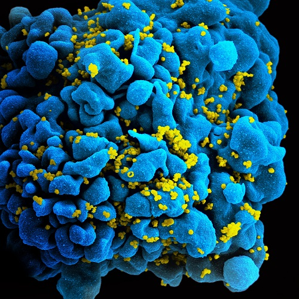
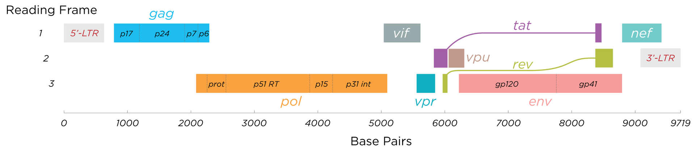
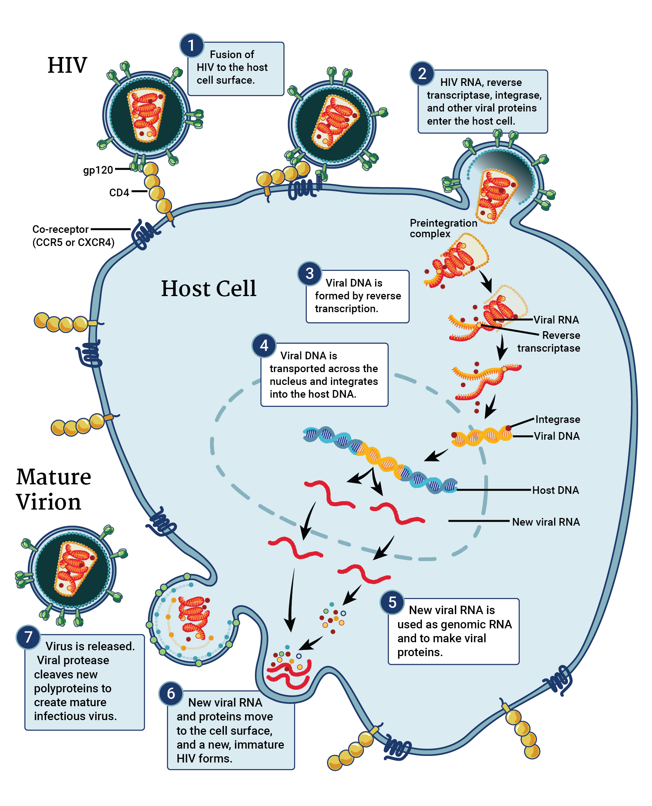
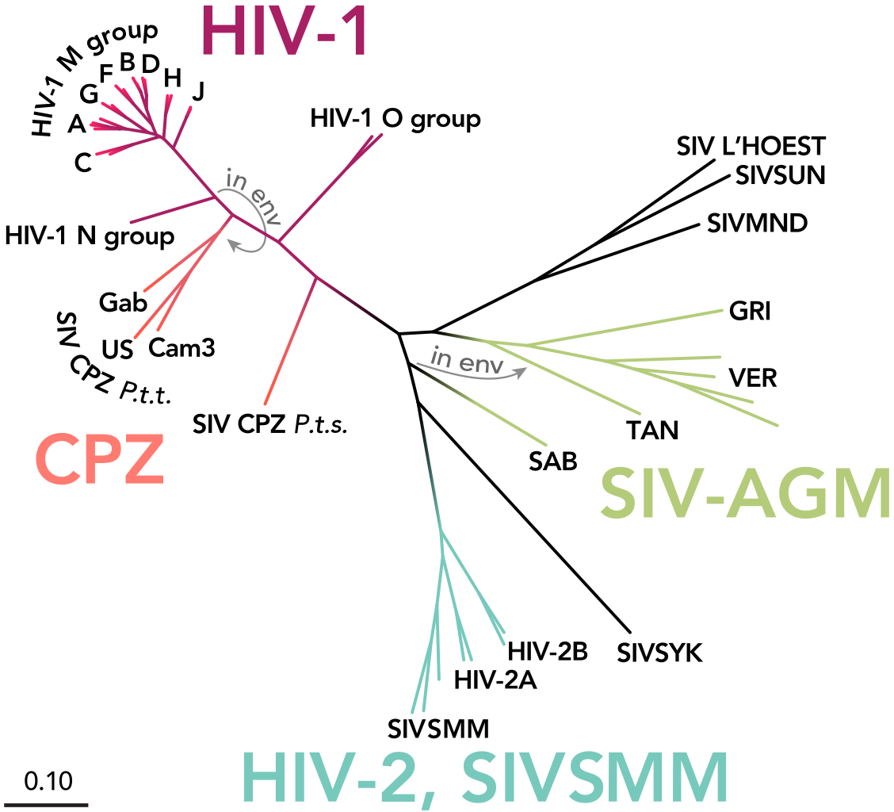
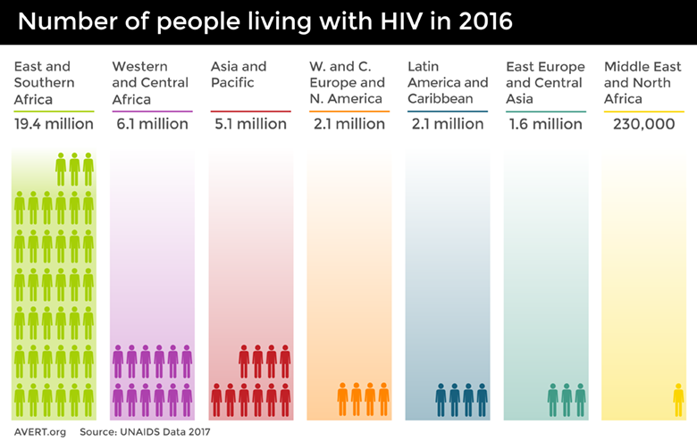
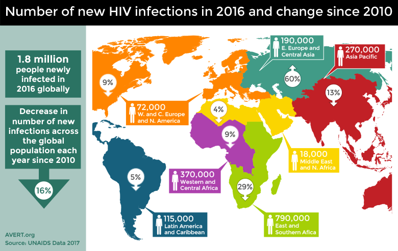

====================
HIV disease overview
====================

|IDM_s| is committed to utilizing modeling approaches and quantitative analysis to explore how
interventions can act to reduce the burden and transmission of HIV. This page provides information
about HIV itself: the biology, symptoms, treatment, and prevention. See :doc:`hiv-model-overview`
for information about the |EMOD_l| HIV simulation type developed by |IDM_s| to aid in HIV control.

.. contents:: Contents
   :local:

About HIV
=========

The human immunodeficiency virus (HIV) attacks the immune system by targeting CD4 positive T cells,
which are white blood cells that serve a crucial role in regulating immune response and fighting off
infection.  When left untreated, HIV drastically reduces the number of CD4 cells, severely weakening
the immune system and enabling :term:`opportunistic infections` and cancers. Once the level of CD4
cells drops below a  threshold, HIV develops into AIDS (acquired immunodeficiency syndrome), the
most severe phase of an HIV infection. There is no cure for HIV, but it is possible to treat and
control the virus. Untreated individuals with HIV/AIDS have an average survival of 9-11 years post-
infection, however with proper treatment, infected individuals can live a normal lifespan.

    Scanning electromicrograph of an HIV-infected T cell. Image credit `NIH, "HIV/AIDS" <https://www.niaid.nih.gov/diseases-conditions/hivaids>`__.

HIV virology
============

HIV is a :term:`retrovirus`. Retroviruses are RNA viruses that are obligate parasites, requiring the
host-cell's machinery to produce new viral particles. Once inside the host cell, the virus uses its
own :term:`reverse transcriptase` enzyme to produce DNA from its RNA genome. The virus integrates
viral DNA into the chromosomal DNA of the host cell, becoming a permanent part of the host genome.
The cellular machinery of host cells is sequestered by the virus to replicate new viral particles.

HIV is a particular type of retrovirus called a :term:`lentivirus`. Characterized by long
incubation periods, these viruses cause chronic and deadly diseases in mammals; in primates, they
target CD4 proteins of the immune system. Host cells are destroyed in the process of viral
replication, causing a significant reduction in immune system cells as viral load increases. As
these vital immune system cells are destroyed, :term:`cell-mediated immunity` is lost and the
individual becomes increasingly susceptible to opportunistic infections.

For more details on how viral replication works, see :ref:`lifecycle`.

Viral structure and genome
--------------------------

.. not sure where I want the figure to sit...

.. figure:: ../images/hiv/HIV-Virus-Structure.png

    Illustration of the viral structure of HIV; image credit
    `Microbe Online, "Structure of Human Immunodeficiency Virus (HIV)" <https://microbeonline.com/describe-structure-of-hiv-virus-t-u-2058/>`__.

HIV is a spherical retrovirus with a typical diameter between 100 and 130 nm--about 60 times smaller
than a red blood cell.  A viral envelope, or lipid membrane, encloses the :term:`virion`. Embedded
in this lipid membrane are 72 envelope proteins, :term:`glycoproteins`, which spike through the membrane.
These surface proteins, :term:`gp120` and :term:`gp41`, are responsible for viral attachment and
entry to host cells. Differences in gp120 are used for identifying HIV types, namely HIV-1 versus
HIV-2, and their subtypes (see :ref:`types` for more information).

Within the membrane is a :term:`capsid`, which contains enzymes and genetic material. The enzymes,
required for virion replication, are :term:`reverse transcriptase`, :term:`proteases`, :term:`ribonuclease`,
and :term:`integrase`. The virion's genetic material is comprised of two copies of single-stranded RNA,
which has 9 genes encoding 19 proteins. Three genes code for structural proteins required
for creating new viral particles. The remaining 6 genes code for proteins that are involved in
HIV's ability to infect new cells, replicate, or cause disease.

.. will want more detail on some of these genes.

**The structural genes:**

#. Group-specific antigen (Gag): responsible for the core structural proteins of the virus
#. Envelope (Env): responsible for gp120 and gp41
#. Polymerase (Pol): responsible for reverse transcriptase, integrase, protease

**The Regulatory genes:**

#. Tat: responsible for activation of transcription of viral genes (required for replication)
#. Rev: responsible for transport of late mRNAs from the nucleus to cytoplasm (required for replication)
#. Nef: Decreases CD4 and MHC class I protein expression in virus-infected cells
#. Vif: Enhances viral infectivity
#. Vpr: Transports the viral core from the cytoplasm into the nucleus
#. Vpu: Enhances virion release from the host cell

    Diagram illustrating the structure of the HIV genome. Image credit `Wikipedia "HIV - Structure and genome" <https://en.wikipedia.org/wiki/HIV#Structure_and_genome>`__.

.. _lifecycle:

HIV replication cycle
---------------------

The replication process to create new HIV virions occurs in three phases. First, the virus needs to
enter the host cell. Second, replication of viral genetic information occurs within the host cell.
And third, and finally, new virions are assembled and released from the host cell.

Ultimately, host cells are destroyed by HIV infection, but this destruction is not the result of the
release of mature virions. Instead, infected cells appear to sacrifice themselves through a highly
inflammatory form of :term:`apoptosis` called :term:`pyroptosis` [Ref1]_, [Ref2]_.  Unfortunately,
pyroptosis tends to lure more CD4 cells to an area, which propagates the infection-destruction cycle,
and increases the damage done to the immune system.

The following diagram illustrates the cycle of HIV viral replication.

    HIV replication cycle, adapted from NIAID and the NIH
    `HIV/AIDS <https://www.niaid.nih.gov/diseases-conditions/hiv-replication-cycle>`__.

Let's explore the cycle in more detail:

Phase I: Cellular entry
~~~~~~~~~~~~~~~~~~~~~~~

In order to enter a host cell, the HIV virion uses the glycoproteins on its surface to attach to the
target cell. Gp120, the distal portion "spike" complex, binds to CD4 receptors (especially on T-cells).
After binding, a cascade of conformational changes occurs in gp120 and gp41, and the virion fuses with
the host cell's membrane.  Once fusion is complete, the capsid (which contains the RNA, reverse
transcriptase, proteases, ribonuclease, and integrase) is injected into the host cell. This process is
represented in steps one and two in the above figure.

Phase II: Replication
~~~~~~~~~~~~~~~~~~~~~

Once the viral capsid enters the host cell, the viral reverse transcriptase acts to copy the viral RNA
into cDNA. The ribonuclease then acts to degrade the viral RNA, and the polymerase creates a complement to
the single stranded cDNA; the newly-formed double-stranded viral DNA is then transported into the host
cell's nucleus, where integrase integrates it into the host cell's genome. This process is represented
in steps three, four, and five in the above figure.

It is worth noting that the process of reverse transcriptase is extremely error-prone. The mutations
arising out of these copying errors are thought to contribute to the development of drug resistance and
to also enable the virus to escape detection by the immune system.

Once the viral DNA has integrated into the cell's genome, the cell uses it's own machinery to transcribe
viral DNA into viral RNA. This viral RNA is either used to build new HIV proteins, or serves as the genome
of new virions.

Phase III: Assembly and release
~~~~~~~~~~~~~~~~~~~~~~~~~~~~~~~

Once the new copies of viral proteins and genomic RNA have been created, they move to the surface of
the host cell. Viral structural proteins (created from the Gag gene) associate with the inner surface
of the host cell, causing a new virion to start forming and bud from the cell. Within the bud, or the
immature virion, are more structural proteins necessary for capsid formation and the viral genome. As the
bud progresses, viral proteases cleave the structural components so they can be assembled to form
a the capsid and other capsid enzymes. The process is completed when the bud is cleaved from the host
cell (mediated by viral proteases), and results in the release of mature virions.  This process is
represented in steps six and seven in the above figure.

.. _types:

HIV types
=========

A hallmark of HIV is the high level of genetic variability the virus exhibits, which can make treatment
very difficult. There are two main types of genetically distinct HIV: HIV-1 and HIV-2, and each type can
further be broken down into groups and subgroups.  HIV-1, the first to be discovered, is the more
common and more virulent strain of HIV. HIV-2 is less transmissible, and is primarily found in western
Africa (although cases are becoming more common in India, and incidence--while still low--is on the rise
in some parts of Europe and the Americas [Ref3]_). Both types follow the same transmission route and have the
same pathology--both may develop into AIDS. Co-infection, or infection with both HIV-1 and HIV-2, is
possible.

    The phylogenetic tree of HIV and SIV (simian immunodeficiency virus), with types and groups labeled.
    Image credit: Thomas Splettstoesser (www.scistyle.com), https://commons.wikimedia.org/wiki/File:HIV-SIV-phylogenetic-tree.svg

HIV-1
-----

HIV-1 is the more prevalent form of HIV, and most information about HIV/AIDS is in reference to HIV-1.
This type is the more virulent, or pathogenic, type: it is highly transmissible and individuals
develop AIDS when it is not treated.

HIV-1 can be broken down into a major group, Group M, and up to three minor groups, Group N, O, and P.
It is thought that each of these groups corresponds to an independent transmission event of SIV
(simian immunodeficiency virus) into humans [Ref4]_.

The major group, M, comprises over 90% of HIV/AIDS cases. It can further be divided into 11 subtypes,
A through K. Recombination between subtypes can also occur, further increasing genetic diversity of HIV.

Many of the subtypes have been identified due to differences in the envelope (env) region--the genes
that code for gp120 and gp41.

HIV-2
-----

HIV-2 is less transmissible than HIV-1, and individuals infected with HIV-2 are less likely to develop
AIDS. Disease progression is slower, and in some cases infected individuals may remain lifelong non-progressors.
Clinically, those with HIV-2 tend to have higher CD4 counts and lower viral loads than those with HIV-1.

HIV-2 has 8 known subgroups: A through H. Currently, only A and B are pandemic, however HIV-2 is predominantly
found in western Africa.

Genetic variability
-------------------

HIV is difficult to treat, largely due to how genetically diverse it is, and how rapidly it can
increase diversity.  This arises due to multiple reasons:

* HIV has a high replication speed. The virion burst size, or number of virions produced per infected
  cell, ranges from 1,000 - 3,000 [Ref5]_, or approximately 10^10 virions per day. For reference, the
  burst speed for influenza (when reared in chicken egg cells) is about 500 - 1,000. This means that
  a huge number of virions are present within an individual, and the numbers increase drastically over
  short amounts of time. Each virion produced is a potentially new variant.

* HIV has a high mutation rate. HIV can mutate at a rate of 3 x 10^-5 per nucleotide base per cycle
  of replication. For reference, DNA viruses have a mutation rate of 10^-6 to 10^-8 per base per generation.
  The human genome (as a whole) mutates at approximately [Ref6]_ 1.1x10^-8 per base per generation.
  With a high mutation rate, the numerous virions produced per day have the potential to be quite variable,
  and variation can increase quite rapidly.

* Reverse transcriptase is error prone and has recombinogenic properties [Ref7]_, [Ref8]_. The high error rate
  of transcription with reverse transcriptase contributes to the high mutation rate seen in HIV.
  However, reverse transcriptase is also highly recombinogenic: there are two copies of RNA packaged
  in the capsid of the virion, and reverse transcriptase has the ability to "jump" between each of the
  copies; this creates crossovers during the replication cycle, and when co-infection occurs in a cell,
  novel or hybrid genomes may be created.

.. _hiv-model-stages: 

HIV symptoms and disease stages
===============================

Unfortunately, there are no distinctive symptoms used to diagnose HIV. The only definitive method of
diagnosis is through testing. Some individuals may experience flu-like symptoms (such as fever, chills,
rash, night sweats, achy muscles, sore throat, fatigue, etc) in the first 2-4 weeks after infection,
but not every infected individual experiences symptoms, and these symptoms are not conclusive. For those
experiencing symptoms, they may persist for a few days up to several weeks. In this early period, HIV
tests may not yield a positive result even though the person is infectious. For more on HIV tests, see
:ref:`tests`.

For more on symptoms, see www.hiv.gov.

Once infected with HIV, there are three stages to the disease, explained in detail below.

Stage 1: Acute HIV infection
----------------------------

Two to four weeks after infection, individuals may experience flu-like illness. In this stage, individuals
are very infectious as the virus is replicating rapidly.

Stage 2: Clinical latency
-------------------------

Also known as HIV inactivity or dormancy, asymptomatic HIV infection, or chronic HIV infection. During
this period, the virus is still active but reproduction has slowed, and typically no symptoms are exhibited.
The duration of this stage is incredibly variable: for some, it may last a decade or more; for others,
it could be much shorter.  Individuals are still infectious in this stage.

Stage 3: AIDS
-------------

One HIV progresses to AIDS (acquired immunodeficiency syndrome), the disease has reached its most
severe phase, and is characterized by progressive failure of the immune system. Because the immune
system is severely damaged,  individuals succumb to increasing numbers of severe illnesses
(opportunistic infections). Without treatment, survival with AIDS is roughly 3 years.  Diagnosis of
AIDS can be by CD4 cell count: individuals with AIDS have CD4 counts of < 200 cells/mm^3  (compared
to healthy individuals, with CD4 counts of 500 - 1600 cells/mm^3). In this stage, individuals are
extremely infectious and have very high viral loads.

Transmission
============

Many myths--and stigmas--persist around how HIV is transmitted. Understanding how it is--and is
not--transmitted is key for the success of control efforts.

It is not possible to become infected with HIV through non-sexual contact with infectious individuals,
nor by sharing an environment with them. HHIV does not survive long outside of the human body, so
it CANNOT be transmitted through:

* The environment, such as through air or water
* Vectors, such as biting insects or other animals
* Sharing toilets, touching surfaces exposed to infectious individuals

HIV is specific to particular body fluids, and does NOT live in saliva, sweat, or tears; it is not
possible to become infected through contact with those fluids, nor by sharing food or drink with
infectious individuals.

HIV has specific transmission routes and it only survives in particular bodily fluids: blood, semen,
pre-seminal fluid, rectal and vaginal  fluids, and breast milk. To get infected with HIV, infected
fluids must come into contact with a mucous membrane or damaged tissue,  or by being injected into
the bloodstream (e.g. with shared needles).

The most common routes of HIV transmission are:

* As an STI (with anal sex as the riskiest type of sex for HIV transmission)
* Vertical transmission: from mother to child during pregnancy, birth, or through breastfeeding
* From shared needles/syringes
* Contact with open wounds (when contact is on damaged tissue)
* Through blood transfusions/organ donations (when the donor blood was infectious)

While certain behaviors can increase risk of HIV (such as unprotected sex or sharing needles), other
factors, such as co-infection with other STDs, can also increase the chances of HIV transmission.
People with STDs are 3 times as likely to get HIV by having unprotected sex with an HIV+ person.
This is because STDs can cause irritation  of the skin, sores, etc, which makes it easier for HIV to
enter the bloodstream. Even just irritation of the genital areas can increase the risk, as it
increases the number of cells that can serve as targets for HIV. Conversely, HIV+ people with an STD
are 3 times more likely as other HIV+ people to spread HIV through sexual contact. This is because
having an STD causes an increased concentration of HIV virus in the semen & genital fluids.

Treatment and prevention of transmission
========================================

There is no cure for HIV, but with proper treatment, those infected with HIV can now live normal lifespans.
Additionally, there are treatments that will prevent transmission, which can be especially important
for :term:`serodifferent` partners.

There are multiple options to reduce the risk of HIV transmission:

* Always use condoms with new partners, HIV+ partners, or those whose serology is unknown. In addition,
  always use proper lubricants.
* Reduce your number of sexual partners.
* Use :term:`PrEP` (see below) for those that are at risk of contracting HIV.
* Use :term:`PEP` or :term:`ART` if you have been exposed.
* Get regularly tested and treated for STDs.
* Encourage HIV+ partners to remain on treatment.
* Male circumcision: circumcision reduces the risk of men getting HIV from HIV+ female partners.

PrEP
----

Pre-exposure prophylaxis, or PrEP is a daily medication that, when taken properly, reduces risk of
HIV by 90% (70% for those using injectable drugs) [Ref19]_. PrEP is a pill that
combines two :term:`nucleoside reverse transcriptase inhibitors (NRTIs)` (tenofovir,
emtricitabine), both of which are used in some ART  combinations. PrEP should be taken by individuals
that are at high risk of contracting HIV.

PrEP reaches its maximum protection effectiveness at about 7 days of daily use for receptive anal sex,
and at about 20 days of daily use for receptive vaginal sex and injective drug use.  Currently, there
little to determine how long it takes to reach maximum protection for insertive anal or
insertive vaginal sex; current information can be found with the `Risk Reduction Tool <https://wwwn.cdc.gov/hivrisk/about_the_data.html>`__.

For more information on PrEP, see `CDC <https://www.cdc.gov/hiv/basics/prep.html>`__,
`What is PrEP <http://www.whatisprep.org/>`__, and
`We > AIDS <https://www.greaterthan.org/PrEP-HIV-prevention/?gclid=CjwKCAiAvMPRBRBIEiwABuO6qU68b-0cU9CU94oM-Xts07uyWpvhzbEkzObeDukGyEO3QEwGdqcZDRoCABsQAvD_BwE>`__.

ART
---

While there is no cure yet for HIV, antiretroviral therapy (ART) can be used to control HIV in
infectious individuals. ART is a daily pill taken by HIV+ individuals, and is comprised of a
combination of 3 medications which work to prevent the HIV virus from replicating. These
combinations are comprised of :term:`nucleoside reverse transcriptase inhibitors (NRTIs)`,
:term:`nonnucleoside reverse transcriptase inhibitors (NNRTIs)`, :term:`protease inhibitors`,
:term:`entry inhibitors`, and :term:`integrase inhibitors`. Using a multi-faceted approach with
different drug combinations has helped prevent drug resistance in patients.

The sooner a patient beings taking ART, the better the treatment and control of HIV. The
`START study <https://www.nih.gov/news-events/news-releases/tarting-antiretroviral-treatment-early-improves-outcomes-hiv-infected-individuals>`__
found that when treatment begins while CD4 counts are still relatively high, patients have a
significantly reduced risk of developing AIDS.  Further, everyone with HIV should be on ART,
regardless of CD4 count: early results have shown that the risk of serious illness or death can be
reduced by 53% in an early treatment group versus a deferred treatment group [Ref9]_.

ART should also be taken to help prevent transmission from infectious to uninfected individuals. The
`HPTN 052 study <https://hptn.org/research/studies/hptn052>`__ found that ART can reduce the risk of
HIV transmission by 93%, and early ART can prevent HIV transmission. ART prevents transmission by
reducing :term:`viral load` to undetectable levels. Recent work by
`Rodger et al <https://jamanetwork.com/journals/jama/fullarticle/2533066>`__ [Ref10]_ found that
individuals on ART with a zero viral load did not transmit HIV to their partners.  However, caution
should still be taken as HIV is theoretically still transmissible, despite having undetectable viral loads.
HIV can still exist in semen, vaginal or rectal fluids, breast milk, or other parts of the body--viral
load tests only measure viral load in blood (see :ref:`tests`). Further, viral load may increase
between tests, making transmission possible even after a test with an undetectable load. Finally,
STDs increase viral load in genital fluids; so having an STD and HIV may increase risk of transmitting
to partners even if viral load is undetectable in blood.

PMTCT
-----

As of 2015, there are an estimated 1.8 million children (under the age of 15) living with HIV [Ref11]_.
The majority of cases in children occur through :term:`vertical transmission`, where HIV was transmitted
to the child from an HIV+ mother during pregnancy, childbirth, or breastfeeding. Prevention of
:term:`mother-to-child transmission (MTCT)` programs, or :term:`PMTCT`, aim to reduce these numbers
drastically. According to the WHO, globally there were over 1.4 pregnant women with HIV in 2016; left
untreated, the risk of HIV transmission to their children can be as high as 45% [Ref12]_. Fortunately,
the risk of MTCT is reduced to less than 5% when women are on ART [Ref11]_, and PMTCT programs have been
largely successful: an estimated 76% of HIV+ pregnant and breastfeeding women received antiretroviral
drugs in 2016.

Despite progress with these programs, there is still much room for improvement. In 2015 an estimated
150,000 children were infected with HIV [Ref11]_, and by the end of 2016, only about 43% of infected
children had access to ART. For children born with HIV, 50% of them will not survive past the age of
two [Ref11]_ without treatment.

For more information on the global PMTCT plans, targets, and progress, see `Avert <https://www.avert.org/professionals/hiv-programming/prevention/prevention-mother-child#footnote14_zn0wh44>`__.

.. _ninety:

90-90-90
--------

The driving goal for HIV is to end the global AIDS epidemic.  To achieve this, `UNAIDS <www.unaids.org>`__
has created an ambitious target program called "90-90-90." Under these guidelines, the goal is that
by the year 2020, 90% of all people living with HIV will know their status; 90% of all people with a
diagnosed HIV infection will receive sustained ART; and 90% of all people on ART will have viral
suppression [Ref13]_.

Achievement of these goals will facilitate ending the worldwide AIDS epidemic by 2030. When the targets
are reached, 73% of all people living with HIV will be virally suppressed--a roughly two- to three-fold
increase over current estimates viral suppression [Ref13]_. Testing is a key step in acheving these
goals, as many people living with HIV are unaware of their status. In 2014, a report by
`UNAIDS <http://www.unaids.org/en/resources/presscentre/pressreleaseandstatementarchive/2014/july/20140716prgapreport>`__
found that approximately 54% of people were unaware of their positive infection status. Fortunately,
current estimates are higher, with roughly 70% of people aware of their HIV status; an additional
7.5 million people need to access testing to reach the 90% target [Ref18]_. To achieve viral suppression,
individuals living with HIV need to have reliable access to treatment. In 2016, approximately 53% of
adults and 43% of children living with HIV had access to treatment [Ref14]_. With the 90-90-90
goals, these numbers are expected to increase rapidly.

However, while universal test and treat remains an important component of combination HIV Prevention
[Ref15]_, [Ref16]_, there is growing skepticism as to whether the 90-90-90 goals, and universal test
and treat in general, will be sufficient to end the epidemic [Ref17]_.

.. _tests:

Testing
=======

Testing is the only definitive method for diagnosing HIV infection, making it the important first step
for care. According to the CDC, everyone between the ages of 13-64 should be tested at least once
during routine care. Those at higher risk of HIV exposure should get tested more frequently, such as
every 3-6 months. No test is able to detect HIV immediately after exposure, so testing regimes need
to be conducted on appropriate time-scales.

There are three main types of tests currently in use; note that any positive test, regardless of type,
requires a follow-up test (usually in a lab) to confirm the results.

#. Nucleic acid testing (NAT): These test for virus in the blood, and is also known as a viral
   load test. These tests tend to be more expensive than other methods, and are not commonly used in
   routine testing. These tests are accurate during the early stages of infection, and can detect
   HIV 10 - 33 days after exposure.

#. Antigen/antibody tests: These test for the presence of HIV :term:`antibodies` and :term:`antigens`.
   When the test is conducted in a lab using blood from a vein, they are able to detect HIV 18 - 45
   days after exposure. When the test is conducted using a finger prick, they are able to detect
   HIV 18 - 90 days after exposure.

#. Rapid tests and home tests: These tests are also antibody tests, and typically rely on blood from
   a finger prick or oral fluid. These tests have been designed to facilitate fast turnaround for
   results.

   a) Some rapid tests are laboratory antibody tests; they utilize vein-drawn blood, and results take
      several days.
   b) Rapid antibody screening tests can be ready in less than 30 minutes, and are used in both clinical
      and non-clinical settings. These tests typically use a finger-prick or oral fluid.
   c) Oral fluid antibody self-test: these tests have been designed for ease of use, so that the patient
      can test themselves. An oral swab is used, and results can be ready in as little as 20 minutes;
      these tests are used at home, in clinics, or in community testing centers.
   d) Home collection kits. These kits are designed to be used in the home; the patient takes a finger
      prick, sends the test to a lab, and can get the results by the next day.

Global HIV burden and statistics
================================

The HIV/AIDS epidemic reached peak mortality in 2005, with 2.6 million deaths [Ref14]_. Since the
start of the epidemic, the `WHO <http://www.who.int/gho/hiv/en/>`__ estimates that over 70 million
people  have been infected, and 35 million have died.  Global efforts at prevention and control have
been  largely successful in reducing the  numbers of infections, and even more successful in
reducing mortality due to HIV. However, despite these efforts and advances, there is still much work
to be done for HIV control.

The Institute for Health Metric Evaluation at the University of Washington tracks mortality and
disease burden for HIV/AIDS with their `Global Burden of Disease (GBD) study <http://www.healthdata.org/research-article/global-regional-and-national-incidence-and-mortality-hiv-tuberculosis-and-malaria>`__.
Despite the enormous increases in funding, HIV/AIDS remains in the top 10 causes of mortality worldwide,
and success in prevention, treatment, and control efforts varies dramatically by country. As of the
end of 2016, there are upwards of 34 million adults--approximately 0.8% of adults
aged 15-49 worldwide--living with HIV [Ref18]_, and almost 2 million children living with HIV [Ref19]_.
Sub-Saharan Africa is the most seriously impacted region, with close to 1 in every 25 adults (4.2%)
living with HIV; this accounts for almost 2/3 of all worldwide cases [Ref18]_.

    The number of people worldwide living with HIV in 2016, broken down by global region.
    Image credit: `Avert <https://www.avert.org/global-hiv-and-aids-statistics>`__.

Because HIV cannot be cured, there have been immense efforts placed on prevention of new infections.
As of 2016, there are still around  2 million new cases in adults [Ref20]_ and 150,000 cases in
children each year [Ref11]_. Despite the high numbers of individuals living with HIV, prevention efforts
have been successful, as overall disease incidence is down. Since 2000, there has been a 35% decrease
in adult infections and 58% decrease in infections in children [Ref21]_.

    The number of new HIV infections in 2016 and the percentage change of infections since 2010.
    Image credit: `Avert <https://www.avert.org/global-hiv-and-aids-statistics>`__.

In addition to prevention of new infections, control of HIV has also focused on the care of individuals
living with HIV, in order to reduce mortality. Approximately 1 million people still die each year from
HIV-related illnesses [Ref18]_. While this number is unfortunately large, it is actually a 42%
decrease from the peak deaths in 2004/2005 [Ref21]_.

Much of the success in prevention and treatment of HIV stems from advances in medication, namely the
antiretrovirals that are available. There has been an 84% increase in access to ART since 2010 [Ref21]_.
Access to ART, combined with the global response to HIV, is responsible for averting roughly
30 million new infections and almost 8 million deaths since 2000 [Ref21]_.  The progress is remarkable,
but the effort continues to halt the spread of HIV.

Benefits of mathematical modeling in the control of HIV
=======================================================

Ending the AIDS epidemic is a formidable challenge that requires a multifaceted and multi-
disciplinary approach. While HIV treatment and prevention efforts are crucial components,
mathematical modeling also plays a  vital role. In general, modeling and quantitative analysis can
provide insight into key factors influencing transmission dynamics and serve as the groundwork for
evidence-based policy- and decision-making.

Modeling approaches have proven to be invaluable for understanding HIV transmission and developing
control strategies. As resources are often limited, modeling can be used to evaluate intervention
strategies and their potential impacts on HIV transmission [Ref22]_ before programs are implemented.
This can provide insight into the cost and cost-effectiveness of treatment programs [Ref23]_, [Ref24]_,
and help determine the ways in which to most effectively use available resources. Further, modeling
can help to identify particular risk groups and target populations that may have the largest impact
on disrupting HIV transmission [Ref25]_. And conversely, models can highlight how targeting particular
risk groups for interventions will not provide enough impact to disrupt transmission, and is in fact,
"too little too late" [Ref26]_.  Finally, modeling was instrumental in determining the population-size
targets for global interventions: the 90-90-90 program (see :ref:`ninety`) utilized models to determine
how many people need to gain access to care in order to end the AIDS epidemic, and, when those targets
are adhered to, when the epidemic should end [Ref13]_.

Controlling HIV/AIDS requires not just population-level understanding of transmission dynamics, but a
thorough comprehension of within-host dynamics as well. Fortunately, mathematical models have also
proven valuable for this, by elucidating the impact and interactions HIV has on the immune system.
Further, models are able to help determine effects of particular drug treatments [Ref27]_, and to
identify optimal drug therapy regimes [Ref28]_.

Further resources
=================

* World Health Organization (WHO), http://www.who.int/mediacentre/factsheets/fs360/en/
* National Institutes of Health (NIH), https://www.niaid.nih.gov/diseases-conditions/hivaids
* Centers for Disease Control and Prevention (CDC), https://www.cdc.gov/hiv/basics/index.html
* UNAIDS, http://www.unaids.org/
* Avert, https://www.avert.org/
* HIV.gov, https://www.hiv.gov/hiv-basics
* Wikipedia, https://en.wikipedia.org/wiki/HIV

Citations
=========

.. [Ref1] Doitsh et al., 2013. Cell death by pyroptosis drives CD4 T-cell depletion in HIV-1 infection. Nature, doi:10.1038/nature12940

.. [Ref2] Monroe et al., 2013. IFI16 DNA sensor is required for death of lymphoid CD4 T cells abortively infected with HIV. Science, doi:10.1126/science.1243640

.. [Ref3] aidsmap, http://www.aidsmap.com/HIV-1-and-HIV-2/page/1322970/

.. [Ref4] Sharp, P. M.; Hahn, B. H., 2011. Origins of HIV and the AIDS Pandemic. Cold Spring Harbor Perspectives in Medicine. 1 (1): a006841–a006835. doi:10.1101/cshperspect.a006841. PMC 3234451 Freely accessible. PMID 22229120.

.. [Ref5] http://book.bionumbers.org/how-many-virions-result-from-a-single-viral-infection/

.. [Ref6] Roach JC, Glusman G, Smit AF, et al., 2010. Analysis of genetic inheritance in a family quartet by whole-genome sequencing. Science. 328 (5978): 636–9. doi:10.1126/science.1186802. PMC 3037280 Freely accessible. PMID 20220176

.. [Ref7] Reeves, Jacqueline D. and Derdeyn, Cynthia A. Entry Inhibitors in HIV Therapy. Boston: Birkhauser Verlag, 2007.

.. [Ref8] Domingo, Esteban; Parrish, Colin R.; and Holland, John J. Origin and Evolution of Viruses. New York: Elsevier, 2008.

.. [Ref9] Strategic Timing of AntiRetroviral Treatment (START) study: https://www.nih.gov/news-events/news-releases/starting-antiretroviral-treatment-early-improves-outcomes-hiv-infected-individuals

.. [Ref10] Rodger et al, 2016. Sexual activity without condoms and risk of HIV transmission in serodifferent couples when the HIV-positive partner is using suppressive antiretroviral therapy. JAMA 316(2): 171-181.

.. [Ref11] UNAIDS, Children and HIV fact sheet. http://www.unaids.org/sites/default/files/media_asset/FactSheet_Children_en.pdf

.. [Ref12] Avert.org, Prevention of Mother-to-Child Transmission (PMTCT) of HIV. https://www.avert.org/professionals/hiv-programming/prevention/prevention-mother-child

.. [Ref13]  UNAIDS, 90-90-90 - An ambitious treatment target to help end the AIDS epidemic http://www.unaids.org/en/resources/documents/2017/90-90-90

.. [Ref14] UNAIDS, HIV fact sheet http://www.unaids.org/en/resources/campaigns/globalreport2013/factsheet

.. [Ref15] Eaton JW, Johnson LF, Salomon JA, Bärnighausen T, Bendavid E, Bershteyn A, et al. HIV Treatment as Prevention: Systematic Comparison of Mathematical Models of the Potential Impact of Antiretroviral Therapy on HIV Incidence in South Africa. PLOS Medicine 2012,9:e1001245.

.. [Ref16]  Tanser F, Bärnighausen T, Grapsa E, Zaidi J, Newell M-L. High Coverage of ART Associated with Decline in Risk of HIV Acquisition in Rural KwaZulu-Natal, South Africa. Science 2013,339:966-971.

.. [Ref17] Akullian A, Bershteyn A, Jewell B, Camlin CS. The Missing 27%. AIDS 2017.

.. [Ref18] World Health Organization (WHO), Global Health Observatory (GHO) data. http://www.who.int/gho/hiv/en/

.. [Ref19] The Global HIV/AIDS Epidemic, https://www.hiv.gov/hiv-basics/overview/data-and-trends/global-statistics

.. [Ref20] World Health Organization (WHO) HIV/AIDS Fact Sheet http://www.who.int/mediacentre/factsheets/fs360/en/

.. [Ref21]  UNAIDS, AIDS by the numbers http://www.unaids.org/en/resources/documents/2015/AIDS_by_the_numbers_2015

.. [Ref22] Kim, S.B, et al., 2014. Mathematical Modeling of HIV Prevention Measures Including Pre-Exposure Prophylaxis on HIV Incidence in South Korea. PLOS One. March 24, 2014.  https://doi.org/10.1371/journal.pone.0090080

.. [Ref23] Eaton, J. W., et al. 2014. Health benefits, costs, and cost-effectiveness of earlier eligibility for adult antiretroviral therapy and expanded treatment coverage: a combined analysis of 12 mathematical models. The Lancet Global Health. V2. e23-234. http://www.thelancet.com/journals/langlo/article/PIIS2214-109X(13)70172-4/fulltext

.. [Ref24] Meyer-Rath, G., Over, M., Klein, D., and Bershteyn, A., 2015. The Cost and Cost-Effectiveness of Alternative Strategies to Expand Treatment to HIV-Positive South Africans: Scale Economies and Outreach Costs - Working Paper 401. Center for Global Development. https://www.cgdev.org/publication/cost-and-cost-effectiveness-alternative-strategies-expand-treatment-hiv-positive-south

.. [Ref25] Bershyteyn, A., Klein, D.J., and Eckhoff, P.A., 2016. AGe-targeted HIV treatment and primary prevention as a 'ring fence' to efficiently intterupt the age patterns of transmission in generalized epidemic settings in South Africa. International Health. 8(4): 277-285. https://doi.org/10.1093/inthealth/ihw010

.. [Ref26] Klein, D., Eckhoff, P., and Bershteyn, A., 2015. Targeting HIV Services to Male Migrant Workers in Southern Africa Would Not Reverse Generalized HIV Epidemics. International Health. 7(2): 107-113. https://doi.org/10.1093/inthealth/ihv011

.. [Ref27] Rivadeneira, P.S, et al., 2014. Mathematical Modeling of HIV Dynamics After Antiretroviral Therapy Initiation: A Review. Biores Open Access v.3(5): 233-241. doi: 10.1089/biores.2014.0024

.. [Ref28] Ogunlaran, O.M., and Noutchie, C.O., 2016. Mathematical Model for an Effective Management of HIV Infection. BioMed Research International. Volume 2016, Article ID 217548, 6 pp. http://dx.doi.org/10.1155/2016/4217548
