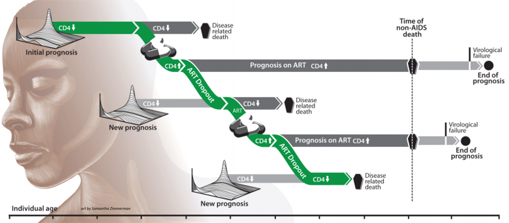

===================
Health care systems
===================

Intervention campaigns in the |EMOD_s| HIV model typically involve health care, treatment, and
access to care. Configuring campaigns involves the use of event coordinators, which determine
who will receive the intervention; campaign events, which determine when and where interventions
will be distributed; and the intervention itself, which determines what will be distributed. For
HIV, these events and interventions can be configured to create a health care system, such that
individuals with particular attributes are selected for particular types of care. For HIV, this
system is termed the cascade of care, and involves testing, diagnosis, and treatment; individuals
can leave and enter the cascade at multiple time points.

For more information on the cascade of care, see :doc:`model-care-cascade`.

Restricting multiple entries into health care
=============================================

Health care in |EMOD_s| is bi-directional: it can be applied to individuals, or it can sought by
individuals in response to various triggering events including birth, sexual debut, pregnancy, or
AIDS symptoms. A potential problem created by this structure is that an individual could end up in
care multiple  times. For example, an individual might have an antenatal care (ANC) visit and, in
the same time-step, seek health care for AIDS symptoms, both leading to HIV testing and staging.

The **HIVMuxer** intervention is a method that can be used to prevent this problem. **HIVMuxer**
counts the number of times an individual is simultaneously waiting in the same delay state or group
of delay states and restricts the number of entries that individual is eligible  to receive.

Diagnostics and testing
=======================

To route individuals into the care and treatment systems, it is necessary to use
diagnostic testing. |EMOD_s| has multiple types of diagnostics, which can be found in
:doc:`parameter-campaign`.  The outcomes of different diagnostic tests can be used to initiate
treatment, prevention services,  entrance into health care systems, or lead to knowledge (such as
HIV status) that will change the individual's behavior. Testing can be triggered by a variety of
factors, such as age, time of sexual debut, onset of symptoms, pregnancy, or simply through
voluntary/routine testing.  The triggers can be configured in the different types of diagnostics,
and different results can be used to initiate care. Tests also have a probability of being wrong,
such that some individuals that test negative may in fact be positive for the disease.

Decisions
---------

Individuals can be enrolled in treatment due to the outcomes of diagnostic testing, but |EMOD_s|
also allows for individuals to make decisions about treatment. These decisions can be based on
factors such as time, age, the individual's current state or sexual debut status, or even a random
choice.

For individuals making a random choice, |EMOD_s| will base the decision on a random coin flip, or if
more than 2 choices are configured in the campaign file, a dice roll. All choices and their outcome
probabilities are configurable; should the sum of the probabilities not equal 1, then |EMOD_s| will
normalize the sum to 1, while keeping their relative proportions the same.

The :doc:`parameter-campaign-individual-hivrandomchoice` class allows you to
configure an array of options and the probabilities for each outcome. In those cases, the
probabilities are not dependent on the number of choices, but must still sum to 1.

History of past treatment guidelines
------------------------------------

The results of diagnostic tests are used to route individuals to treatment, with target levels for
CD4 counts, WHO stage, or other factors used to determine the course of action for the individual.
Over the past several decades, such treatment guidelines have changed, and |EMOD_s| allows for these
changes in guidelines to be incorporated into the diagnostics. For example, cut-off values for CD4
counts by age and pregnancy status to determine eligibility for treatment have expanded in South
Africa over the past 20 years. Configuring **InterpolatedValueMap** (which consists of arrays of
**Times** and **Values**) for their appropriate parameters will let the model utilize these
different diagnostic levels in the appropriate years.

The below :term:`JSON (JavaScript Object Notation)` example shows the **HIVARTStagingCD4AgnosticDiagnostic** intervention class,
where several parameters demonstrate configuring past history guidelines. For example,
**Adult_By_WHO_Stage** has different WHO stage category recommendations for ART eligibility
depending on year, and **Child_Treat_Under_Age_In_Years_Threshold** shows how the age at which
children were eligible for ART changed over time.

.. literalinclude:: ../json/hiv-cd4agnosticdiagnostic.json
   :language: json
   :emphasize-lines: 33-39, 57-63

.. _art:

Antiretroviral therapy (ART)
============================

.. ART/CD4: https://wiki.idmod.org/pages/viewpage.action?spaceKey=EMOD&title=Feature+Checklist See section 3. ART

Survival time for untreated HIV is described in :doc:`hiv-model-intrahost`, with individuals progressing
through the three diseases stages (acute, latent, AIDS). Antiretroviral therapy (ART) significantly
alters this progression and impacts survival in a positive way (for more information on ART, see
:doc:`hiv-disease-overview`). In |EMOD_s|, survival time on ART is assumed to follow a Weibull
proportional hazards model published by May et. al.  with the IeDEA Southern Africa
collaboration [Ref32]_. The  hazard ratios are applied proportionally to weight and CD4 count (at
initiation of ART for both), and are applied categorically to  WHO stage (at initiation of ART),
gender, and age. Body weight is assumed to be linked to WHO stage progression, with linearly
declining body weight between each transition.

The hazard ratios are shown in the following tables:

+---------------------------+-------------------+-----------------------------------+
| Category                  | Hazard ratio base | Hazard ratio multiplier           |
+===========================+===================+===================================+
| Body weight at initiation | 21:1              | 0.93 per kg                       |
+---------------------------+-------------------+-----------------------------------+
| CD4 count at initiation   | 1:32              | 0.9925/cell/uL up to 350 cells/uL |
+---------------------------+-------------------+-----------------------------------+

  Continuously applied hazard ratios

The reduction in hazard of death per increase in CD4 count is capped at a CD4 count of 350 cells/uL,
such that individuals initiating at CD4 counts greater than 350 cells/uL receive the same
CD4-related hazard adjustment as those with a CD4 count of 350 cells/uL. In other words, the model
currently makes a conservative assumption that the health benefit of initiating at CD4 counts
greater than 350 cells/uL is identical to that of initiating at exactly 350 cells/uL.

+------------+------------+--------------+
| Category   | Value      | Hazard ratio |
+============+============+==============+
| WHO stage  | 3 or 4     | 2.71         |
+------------+------------+--------------+
| Gender     | Female     | 0.68         |
+------------+------------+--------------+
| Age        | >40 years  | 1.43         |
+------------+------------+--------------+

  Categorically applied hazard ratios

There are multiple campaign classes that are used to implement ART programs in the model. To enroll
individuals on ART, the **ARTBasic** intervention is applied. To remove individuals from ART, the
**ARTDropout** intervention is applied. Note that both of these interventions will only impact
individuals that are HIV+; in order to use ART as a prophylactic, the **SimpleVaccine** class must
be used (see :ref:`prep`). Finally, eligibility for ART can be determined through two classes,
**HIVARTStagingCD4AgnosticDiagnostic** and **HIVARTStagingByCD4Diagnostic**. When using CD4-dependent
ART interventions, it is important to use the **HIVDrawBlood** intervention first, as this acts
analogously to performing phlebotomy and logs an HIV-infected individual's current CD4 count.

Note that the multiplicative effect of ART for reducing HIV transmission is set in the configuration
file, while the campaign interventions used determines who receives the effects of ART and at what
time periods. See :doc:`sti-model-transmission` for more information on STI transmission and the factors
that influence it.

ART's impact on CD4 count
-------------------------

CD4 count declines with advancing HIV disease progression, but CD4 counts can be reconstituted with
ART. The `Swiss HIV Cohort Study <http://www.shcs.ch>`__ demonstrated that absolute changes in CD4
counts from the baseline measurement are consistent over the first few years of ART, independent of
the baseline value. For example, a patient starting with a CD4 count of 100 cells/uL, will, on
average, reconstitute to 200 cells/uL in the same time that a patient starting at 200 cells/uL will
reconstitute to 300 cells/uL. This reconstitution rate follows a quadratic increase that saturates
over three years, and can be calculated with the equation,

  CD4 count increase = 15.584 x (months since initiation) - 0.2113 x (months since initiation)^2

Interruption of ART will initiate a decline in CD4 count, and resumption of ART will then initiate
another reconstitution of CD4. |EMOD_s| calculates survival time on ART discontinuation by first
determining what the survival time would have been for a newly infected individual at the age
when discontinuation occurred, and then adjusts the time to account for potentially low CD4 at
discontinuation using the following equation:

  % survival time applied at ART discontinuation = (CD4 at discontinuation)/(CD4 at infection)

.. verify with Anna, DanB isn't sure (not in the code)

The slope of CD4 decline is comparable to a newly infected individual, but the infection is
"fast-forwarded" proportionally to the loss of CD4 count relative to a newly infected individual.

When ART is re-initiated, survival is drawn from the distribution corresponding to the updated CD4
count and age at re-initiation. Mortality rates on ART are modeled as Weibull distributions with a
shape parameter <1, which produces a "super-exponential" mortality curve (i.e. one with a
probability density function that declines more rapidly than an exponential distribution). This
produces an elevated mortality rate soon after ART initiation, and a lower mortality rate as time on
ART increases. Discontinuation and re-initiation of ART produces higher mortality rates than
continuous ART by repeatedly exposing the individual to this high early mortality rate.

.. insert figure from p. 62?

.. Not sure if I should include a subsection on ART staging. (lots of diagrams, p. 129, 132, etc)

    An example of CD4 counts and prognosis for a patient on and off ART. Art by Samantha Zimmerman.

.. _prep:

Pre-exposure prophylaxis
========================

Antiretroviral therapy as treatment for HIV was explained above, in :ref:`art`. ART can also be
used as pre-exposure prophylaxis  (:term:`PrEP`), to prevent the transmission of HIV. In |EMOD_s|, the
ART interventions are only used for treatment for HIV+ individuals, so to use ART as a prophylactic,
it is treated as a "vaccine" and the vaccine intervention classes are used.

Citations
=========

.. [Ref32]  May M, Boulle A, Phiri S, et al. Prognosis of patients with HIV-1 infection starting antiretroviral therapy in sub-Saharan Africa: a collaborative analysis of scale-up programmes. The Lancet 2010; 376:449–457

