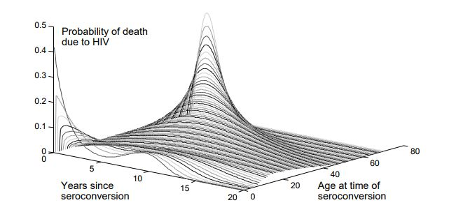

==================================
Intrahost dynamics and HIV biology
==================================

The |EMOD_s| HIV model adds within-host HIV biology to the transmission modality of the STI person-
to-person contact network. This allows the production of HIV-specific transmission rates, mortality
rates, and the progression of biomarkers (such as CD4 count) specific to HIV-infected individuals.
These  factors can vary according to individual-specific traits, such as age, disease state, co-
infection status, use of antiretroviral therapy, or other attributes.

The following sections describe how the model functions for untreated HIV. Treatment, such as
health care and continuous enrollment on ART will alter the survival rates, and will be described in
:doc:`hiv-model-healthcare-systems`.

Disease progression
===================

The |EMOD_s| HIV model uses three stages of untreated HIV infection: acute, latent, and AIDS.  The
durations of acute and AIDS are configurable in the config.json file. The total survival time with
HIV is sampled stochastically based on the individual’s age at the time of infection, and the
duration of the latent stage is the total survival time minus the duration of the acute and AIDS
stages.  If the total survival time is shorter than the sum of the acute and AIDS stages, then the
latent stage is eliminated and the AIDS stage is shortened as needed; in rare cases when survival is
shorter than the acute stage, the remaining acute stage is shortened to fit within the survival
duration and there is no AIDS stage.

Survival with untreated HIV infection
-------------------------------------

HIV prognosis is both heterogeneous and highly age-dependent, so survival is sampled from an
age-dependent :term:`Weibull distribution`, shown below.

    Age-dependent survival distribution for untreated HIV; figure reprinted from `Bershteyn et al 2013 <http://rsif.royalsocietypublishing.org/content/royinterface/10/88/20130613.full.pdf>`__.

Survival times for untreated HIV are determined at the time of infection using the above age-
dependent distribution. There are different parameters used to configure the age distributions for
children vs. adults, and the age at which an individual should no longer follow the children's
distribution can also be configured. The survival distribution for children is a convex combination
of two Weibull distributions, to capture the bimodal nature of survival in children (children can be
categorized as "rapid" or "slow" progressors). To configure this distribution, it is necessary to
determine the fraction of children in each category, the decay rate of survival for rapid
progressors, and the Weibull parameters for the slow progressors. For adults, the  survival time is
Weibull distributed, with older individuals having a shorter average survival time. These
parameters are configured in the config.json file.

.. include the equation on pdf pg. 40 for childhood survival??
.. include images from the pdf, ex survival on pg 47

CD4 count
=========

CD4+ T cells are immune system cells that fight off infection (see :doc:`hiv-disease-overview` for
more information). Measuring the count of CD4 cells is a method to gage how well the immune  system
is functioning, or for HIV, to measure the progression of the disease.  In the |EMOD_s| HIV model,
CD4 count is initialized at a value that is selected from a :term:`Weibull distribution`. During an
untreated HIV infection, CD4 declines such that the square root of the count varies linearly between
a starting point (the "post infection" point) and the count at death. This assumption of  decline
does not include the rapid and complex dynamics of CD4 counts during early HIV infection and during
late-stage AIDS.

The survival time for untreated infection corresponds to the duration required for the change in
CD4 count from initiation to end, and is used to determine the slope for declining CD4. However,
some individuals may later initiate ART and survive longer than the time used to compute the slope.

The heterogeneity in CD4 count can be configured for the starting and ending counts; see
:doc:`parameter-configuration` for more information. Because CD4 counts are Weibull-distributed
parameters, the scale and heterogeneity can be configured. The scale parameters set the post-
infection and at-death values, while the heterogeneity parameters are the inverse of the Weibull
shape. Setting the heterogeneity to small values is equivalent to large shape parameters, and will
result in a sharp peak near the scale value. Setting heterogeneity to zero will cause the initial
CD4 count to be equal to the post-infection scale value.

.. Dan's comment We use a LogLogistic draw instead of a Weibull to determine CD4 at death.  Anna might want this changed back to Weibull.
.. so: does this mean that we don't use the weibull for the initial draw??

WHO stage
---------

The WHO has created `clinical staging definitions <http://www.who.int/hiv/pub/guidelines/HIVstaging150307.pdf>`__
to define and track the stages of HIV progression. Each WHO stage advances from 1 - 4 with transition
times sampled from a :term:`Weibull distribution` and is associated with declining bodyweight. In
|EMOD_s|, both CD4 count and the current WHO stage influence the individual's survival, although the
WHO stage is not a configurable parameter. Note that WHO stage will determine eligibility for ART
interventions. For more information, see :doc:`hiv-model-healthcare-systems`.

WHO stage is assumed to progress in proportion to an individual’s assigned survival time, but has
added randomness to account for variability in HIV symptoms (and resulting ART eligibility) over a
range of CD4 counts. Following a model by Johnson et al [Ref31]_, progression across WHO stage
categories is divided into Weibull-distributed durations over the interval of survival, using the
Weibull parameters tabulated below:

+-----------------------+--------+---------+
| WHO stage transition  | Shape  | Scale   |
+=======================+========+=========+
| 1 to 2                | 0.9664 | 0.26596 |
+-----------------------+--------+---------+
| 2 to 3                | 0.9916 | 0.19729 |
+-----------------------+--------+---------+
| 3 to 4                | 0.9356 | 0.34721 |
+-----------------------+--------+---------+

The WHO stage is generally considered an integer of 1, 2, 3, or 4. To provide additional information
about how close an individual is to advancing to the next WHO stage, |EMOD_s| interpolates between
transitions. For example, if an individual advances from WHO stage 1 to WHO stage 2 over the course
of 100 days, the WHO stage on the 90th day will be 1.9. To obtain the expected integer value of WHO
stage, the output should be rounded down. To examine WHO stage (and CD4 count) over time,  it is
possible to log each individual's infection status with output reports. See
:doc:`hiv-model-overview` for more information.

While the base infectivity parameter serves as the transmission rate for latent HIV, it is possible
to modify the rate for the acute and AIDS stages of the disease. Disease stages have both a duration
and multiplier that must be configured. During the latent stage, neither of the multipliers for the
acute or AIDS stages are applied, and the duration of the latent stage is calculated by subtracting
the durations of the acute and AIDS stages from the overall survival time. If individuals receive
survival durations that are shorter than the sum of the acute and AIDS stage durations, then the
latent stage is eliminated. The acute stage will receive the multiplier for its entire duration, and
the AIDS stage will receive it's multiplier for the remainder; should the survival time be shorter
than the acute stage duration, the acute multiplier will be applied for the full survival duration.

Symptomatic presentation
------------------------

Survival with HIV is highly dependent on receiving proper treatment with ART. Unfortunately, HIV
symptoms typically are not diagnostic until the individual has reached the AIDS stage, which makes
survival probability low. In |EMOD_s|, the model independently draws the time at which an individual
may present for care due to AIDS-related symptoms. The time between symptomatic presentation and
(untreated) AIDS-related death is assumed to be Weibull-distributed, and these parameters can be
configured in the config.json file (see the "mortality and survival" section of
:doc:`parameter-configuration` for more information).

Upon infection or ART discontinuation, the individuals draw from the configured Weibull distribution
to determine the time between symptomatic presentation and untreated AIDS-related death. The
duration is subtracted from the AIDS-related death date to determine the time of symptomatic
presentation. Small values lead to symptomatic presentation close to the time of AIDS-related death,
and large values lead to symptomatic presentation well before AIDS- related death. If the drawn time
is longer than the total survival time, then the total survival time is used (i.e., symptomatic
presentation occurs immediately upon infection). The date of symptomatic presentation has no direct
impact on clinical progression; however, it can be used to configure health-seeking behavior.

Citations
=========

.. [Ref31] Johnson LF, Dorrington R. Modelling the demographic impact of HIV/AIDS in South Africa and the likely impact of interventions. Demographic Research 2006; 14:541–574.

