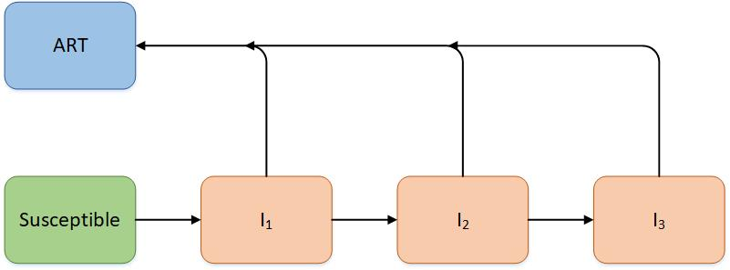
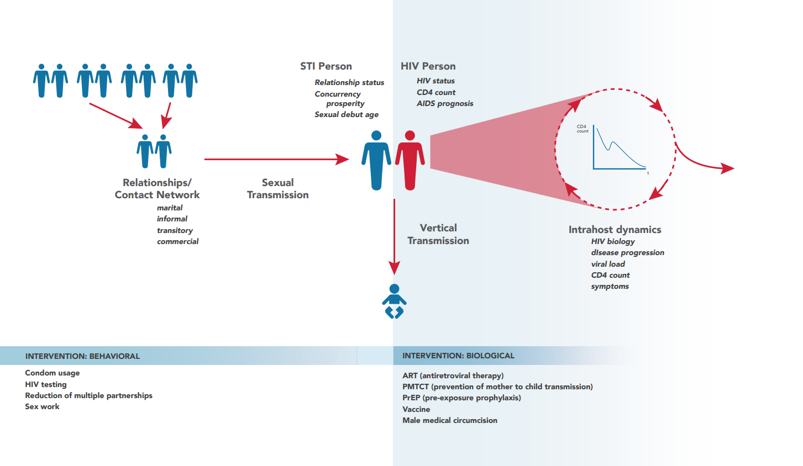

==================
HIV model overview
==================

The |EMOD_s| HIV model is an agent-based stochastic simulator of sexual and vertical HIV
transmission. It is used to simulate HIV conditions for national-level epidemics in order to
evaluate the cost and impact of various treatment and control programs. The model utilizes
microsolvers to combine detailed information on human immunity, within-host viral dynamics, the
effects of antiretroviral drugs, and other aspects of HIV virology to simulate HIV transmission.
To use the HIV model, set the configuration parameter **Simulation_Type** to
HIV_SIM.

.. include DTKschematic figure?

HIV model framework
===================

The most simplistic method
of modeling HIV would be to use an SI compartmental model. Recall that
in an SI model, individuals are born with no immunity; once becoming infectious, there is no resulting
immunity gained from the disease and individuals remain in the infectious stage for life. Some HIV
modelers increased the complexity of their compartmental models by using an SIR model, but modify the compartments by replacing "Recovered/Removed" with "AIDS," thereby
creating an "SIA" model [Ref29]_. Another option for increasing the fit of compartmental models is to
add multiple stages of I, allowing for differentiation of the stages of HIV progression. This also
enables the addition of ART to the model, where individuals can enter ART at different rates, and
then return to survival rates that are similar to HIV- individuals [Ref30]_.

.. not sure if the above figure is ok..UPDATE THE FIGURE.

While |EMOD_s| is an agent-based model, individuals move through the infectious states analogously
to the compartmental models described above. To account for the real-world complexity of HIV
transmission, numerous parameters have been added to |EMOD_s| to increase its predictive power.
Further, these parameters and their associated microsolvers allow |EMOD_s| to model aspects of HIV
infections and population dynamics that do not readily fit into the SI framework (for example, the
complexities that arise due to relationships and human contact networks). Finally, as an agent-
based model, |EMOD_s| enables the addition of spatial and temporal properties to the simulation.

The following network diagram breaks down the model into various model components, and illustrates
how they interact with one another.  The components on the network diagram correspond to the
structural components  listed below. The following pages will describe in detail the general model
functionality and how the structural components function.

  Network diagram illustrating the HIV model and its constituent components.

.. the flowchart is still being worked on by Courtney; this is just a placeholder.

The HIV simulation type adds a layer of HIV-specific biology to the general STI framework, which
includes co- factors and interventions affecting transmission, as well as disease progression on and
off therapy. 

Cascade of care
===============

By using campaign interventions and the appropriate :term:`event coordinator`, it is possible to
configure retention along a care continuum to model how individuals progress with detailed
time-linked variables associated with access to care. For more information on configuring a cascade
of care, see :doc:`model-care-cascade`. For configuring HIV-specific treatment
guidelines and cascades of care, such as participation in ART programs and associated drop-out
rates, see :doc:`hiv-model-healthcare-systems`. 

Individuals are guided through care cascades using individual properties, a very flexible and
powerful feature of the model.  With this feature, it is possible for you to create a set of tags
for individuals in order to target them for events such as specific interventions, types of care, or
even having a specific risk level. For more information on how individual properties, see
:doc:`model-properties`.

Model output and reporters
==========================

|EMOD_s| supports numerous methods for viewing simulation output. By default, every simulation
creates an :term:`output report` of aggregated data (see :doc:`software-overview` for more
information). While |EMOD_s| enables the creation of custom reports, the HIV model has an extensive
list of available built-in reports. The reports are enabled in the config.json file (see
:doc:`parameter-configuration-output` for a complete list) and provide information on
aspects of relationships and pair formation, infection status (including CD4 counts, WHO stage, and
start and stop years), ART status, demographics, mortality, and other pertinent information. Note
that it is important to keep track of which reports are enabled when running simulations, as some
output files may not be desirable or appropriate with the simulation configuration. For example,
**Report_HIV_Infection** creates a .csv file which logs the state of each individual at each time-
step, so as the population grows or the simulation duration increases, this file will become
extremely large and simulations can take much longer to complete.

.. add more info: see the excel sheet with all the reporter info...(also appendix A)

The following pages describe the structure of the model and explore the model components. Additionally,
the specifics of the model are discussed in detail in the articles
`Bershteyn, Klein, Wenger, and Eckhoff, arXiv.org <https://arxiv.org/pdf/1206.3720.pdf>`__, and
`Klein, Bershteyn, and Eckhoff, AIDS 2014 <https://journals.lww.com/aidsonline/Abstract/2014/01001/Dropout_and_re_enrollment__implications_for.6.aspx>`__.

.. toctree::
   :maxdepth: 3
   :titlesonly:

   hiv-model-intrahost
   hiv-model-healthcare-systems

Citations
=========

.. [Ref29] Jun-jie, et al, 2010. Dynamic mathematical models of HIV/AIDS transmission in China. Chin Med J. 123(15): 2120-2127. https://www.ncbi.nlm.nih.gov/pmc/articles/PMC5523934/

.. [Ref30] Williams. 2014. Fitting and projecting HIV epidemics: Data, structure, and parsimony. https://arxiv.org/ftp/arxiv/papers/1412/1412.2788.pdf

