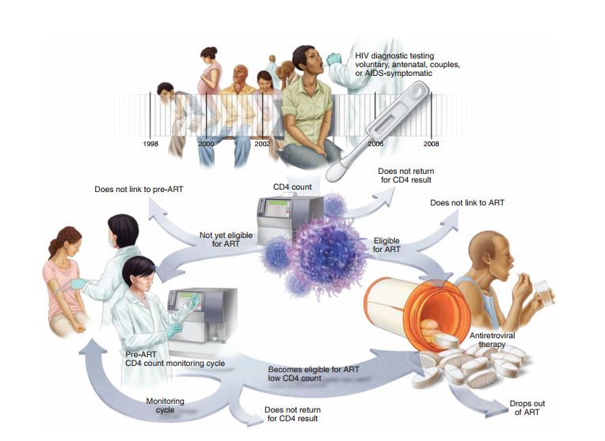
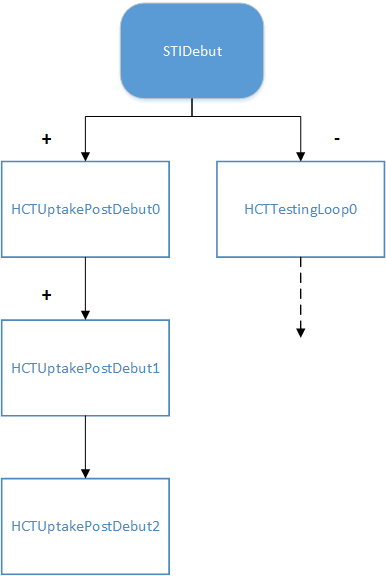

===============
Cascade of care
===============

Some diseases, such as HIV, have a complex sequential cascade of care that individuals must
navigate. For example, going from testing to diagnosis, receiving medical counseling, taking
antiretroviral therapy, and achieving viral suppression. Other life events, such as pregnancy,
migration, relationship changes, or diagnostic criteria may trigger different medical interventions.

Health care in |EMOD_s| can be applied to individuals, such as through a vaccination campaign, or be
sought out by various triggering events including birth, pregnancy, or symptoms. A potential problem
created by this structure is that an individual could end up in care multiple times. For example, an
individual might have an antenatal care (ANC) visit and, in the same time step, seek health care for
AIDS symptoms, both leading to HIV testing and staging.

To avoid this situation, you can configure interventions using the InterventionStatus individual
property in the demographics file (see :ref:`demo-properties` for more information). In the
demographics file, create as many property values as necessary to describe the care cascade. For
example, undiagnosed, positive diagnosis, on therapy, lost to care, etc.

In the campaign file, set up your :term:`event coordinator` as you typically would, using
**Target_Demographic**, **Property_Restrictions_Within_Node**, and other available parameters to
target the desired individuals. See :doc:`model-targeted-interventions` for more information on
targeting interventions and :doc:`parameter-campaign-event-coordinators` for all available
event coordinators.

Then, in the intervention itself, you can add any properties that should prevent someone who would
otherwise qualify for the intervention from receiving it. For example, someone who has already
received a positive diagnosis would be prevented from receiving a diagnostic test if they sought out
medical care for symptoms. You can also add the new property that should be assigned to the
individual if they receive the intervention.

The following example shows a simplified example with two interventions, a diagnostic event and
distribution of medication. The demographics file defines intervention status values for having
tested positive and for being on medication.

.. literalinclude:: ../json/howto-carecascade.json
   :language: json

Cascade of care for the HIV model
=================================

While health care systems, with individuals entering and leaving care, can be configured in all
|EMOD_s| sim types, the HIV model makes particular use of this feature. Living with HIV requires a
series of health actions that enable individuals to reach and continue care; these actions also
impact the partners of HIV+ individuals.

Generally, the HIV cascade of care begins with a positive diagnostic test and linkage to ART.
In practice, the cascade is more complicated. There are multiple routes to initiate diagnostic
testing, and individuals may not always be eligible to enroll on ART. Further, once a patient begins
ART, there is no guarantee that they will remain on ART. In some cases, patients do not return for
their test results, or are otherwise lost to follow-up (:term:`LTFU`). The figure below depicts the
potential routes for the HIV cascade of care.

    Cartoon depicting the cascade of care for HIV patients. Reprinted from `Klein et al 2014 <https://journals.lww.com/aidsonline/Abstract/2014/01001/Dropout_and_re_enrollment__implications_for.6.aspx>`__.

Entry into the cascade: types of testing
----------------------------------------

The cascade of care is, in its simplest form, a series of interventions that are distributed to
individuals based on properties that individual was assigned, either by configuration in the
demographics file, or  by assignment of the model as they were born into the simulation population.
Therefore, entry into the cascade is simply a matter of possessing the appropriate properties as
required by the particular intervention.

However, when creating a health care system for HIV, entry into care routes is accomplished through
testing. As individuals receive diagnostic tests, their results will enable them to enter into the
care system. There are several types of tests that can be implemented:

* Voluntary counseling and testing. Individuals that have reached (or passed) the age of sexual
  debut are eligible to receive regular testing. These individuals can get tested at a configurable
  rate which can vary by calendar year. Unlike other forms of testing,   voluntary can only result
  in one positive result; after which, individuals are linked to care (although they may fail to link
  or drop out).
* Antenatal testing. Pregnant women can receive testing, typically at 12 or 14 weeks gestation. These
  rates are also configurable, and can vary by calendar year.
* Infant testing. Infants born to HIV+ mothers have a probability of being tested (typically at 6
  weeks of age).   The probability is configurable, and can change over time.
* Symptomatic testing. Individuals can get tested when they become symptomatic, which is predicted
  based on CD4 count. The probability of seeking testing when symptomatic is configurable, but is
  typically set to 100%. However, symptoms may present at different CD4 counts for different
  individuals; gender-based percentages for symptom presentation are configurable.

.. removed bc Dan says we don't have it in the model yet:
.. Couples testing. Couples testing only occurs if an individual tests positive, returns for a CD4
.. result/staging, is deemed ineligible for ART, and links to pre-ART care. Such individuals are
.. instructed to bring a partner for testing at the first pre-ART follow-up appointment. The
.. probability of returning with a partner, and the threshold for how long the couple has been in a
.. relationship to qualify for couples testing, are configurable parameters. Partners that test
.. positive are eligible to initiate their own treatment cascade.

It is possible to create different triggers for testing, by using the **IndividualProperties** in
the demographics file (see :doc:`parameter-demographics` for more information). The   **Property**,
**Value**, and **Initial_Distribution** parameters can be used to tag individuals in  as detailed a
manner as needed, and interventions (such as diagnostic tests) can be configured to  use those tags
for the target of the intervention. |EMOD_s| keeps track of age, pregnancies, births, and other
time-sensitive events, and updates those properties as needed.

Moving through the cascade
--------------------------

Individuals enter the cascade when one of their properties is targeted by a diagnostic test, for
example, by reaching the age of sexual debut, showing HIV symptoms, or by having a "high risk"
label. Next, the model will use the positive test to activate the next step in care, such as an
intervention configured to link the individual to ART or to initiate a follow-up test. Accuracy in
test results is not perfect, so there is a probability of receiving a false negative test result for
some individuals, and they will not enter the care system. Those entering care typically schedule a
follow-up appointment to receive a CD4 count result and to determine their disease stage and ART
eligibility. Not all individuals will return for this round of testing and will subsequently be lost
to follow-up (LTFU). All LTFU individuals will not return through the volunteer testing route. CD4
count test results determine if the individual is eligible to begin ART or should link to pre-ART if
ineligible. The probability of linking to pre-ART can be configured to increase over time (such that
it matches historical trends). Pre-ART treatment consists of monitoring visits that are scheduled to
occur regularly (e.g. every 6 months), and the probability of returning for consecutive visits can
be configured. Individuals can become eligible for ART during these visits. For individuals on ART,
rates for dropout can be configured (and may also change over duration on ART).

To summarize, the cascade of care system consists of a series of campaign intervention classes
which are configured to have dependencies based on the previous intervention (or it's outcome).
The simplified version is as follows:

#. Start with diagnostic testing.
#. If positive, enroll in follow-up testing.
#. HIV+ individuals link to either pre-ART or ART.
#. If pre-ART, individuals return periodically for monitoring; may eventually link to ART.

Care systems will likely be much more complicated: there are many "leaky" points in the cascade,
where individuals can drop out of care or are LTFU. Further, care systems can be created to
specifically mirror current care systems, and so may differ in the types and numbers of diagnostics
used, the probability that individuals will return or drop out of care, and the treatment guidelines
that will trigger entry into the care system itself. Note that treatment guidelines can change over
time in order to match the history of past guidelines (see :doc:`hiv-model-healthcare-systems` for more
information).

Configuring the cascade
-----------------------

Configuring a cascade of care system can be complicated, as it is akin to creating a large
network with many dependent properties. However, it can be simplified by breaking the process down
into its component steps.

First, in the demographics file, use the **IndividualProperties** parameters
(:doc:`parameter-demographics`) to appropriately "tag" individuals to make them eligible  (or
ineligible) for treatment. For example, the **Property**, **Values**, and **Initial_Distribution**
parameters can be configured to partition the population into those who will be accessible for
treatment versus those who will not be accessible. Further, additional properties can be added, such
as **InterventionStatus**, where the **Values** array contains a list of statuses which may act to
trigger an event that will cause an intervention to be distributed, or disqualify the individual
from a particular type of care (the  proportion of individuals starting out in each category  is
listed in the **Initial_Distribution** array). The **InterventionStatus** IndividualProperty can be
used to keep track of where individuals are within the cascade, and to help prevent them from being
in more than one arm of the cascade at a time.

The following example shows a population with 80% individuals accessible to health care, and all
individuals starting out without any intervention labels (e.g., at the start of the simulation, no
one is in a category for health care).

.. literalinclude:: ../json/hiv-accessibility.json
   :language: json

.. so: need to include that all cascade events need to be listed in Listed_Events in the config file??

After setting up the population, it is time to configure the health care cascade itself. This is
done in the campaign file, using a series of different campaign interventions and event coordinators
to determine which interventions (such as diagnostic tests, or treatment regimes) will be utilized,
who will be targeted for the interventions, and when (or how) the interventions will be triggered.

As described in :doc:`software-campaign`, distributing an intervention (for example a diagnostic
test), it is necessary to configure a :term:`campaign event`, an :term:`event coordinator`, and the
actual :term:`intervention` itself. So to configure a care cascade, start with the most basic route
for care, such as a diagnostic test given to individuals that have reached the age of sexual debut,
and build up the conditions. You will need to determine:

* What will trigger the intervention (in this example, reaching the age of sexual debut)
* What properties will disqualify individuals from receiving the intervention
* What the actual intervention will be (here, a diagnostic test)
* What will occur as a result of the intervention (here, what happens due to positive or negative
  test results)
* What new value (i.e., tag) to assign individuals that have received the intervention

.. literalinclude:: ../json/hiv-carestep1.json
   :language: json

The above example of syntax demonstrates a potential first step in a care cascade. Note that the
intervention **NodeLevelHealthTriggeredIV** is used to target all individuals in the node that have
the property "Accessibility" : "Yes". If we were using the example from the demographics file shown
above, this would target 80% of our population. Then, those targeted individuals are further
broken down into those that have reached the age of sexual debut, using the
**Trigger_Condition_List** value of "STIDebut". The individuals meeting that criteria are given the
intervention **HIVSigmoidByYearAndSexDiagnostic**, which is a diagnostic test that allows for the
probability of a positive diagnosis to be configured sigmoidally in time. Individuals are excluded
from this intervention if they are on ART, on PreART, are linking to ART or PreART, or are undergoing
ARTStaging (as described in the **Disqualifying_Properties**). The **New_Property_Value** parameter
will reassign the individuals receiving this intervention a new **InterventionStatus**, and the
parameters **Positive_Diagnosis_Event** and **Negative_Diagnosis_Event** will determine the next
step in the cascade care system for individuals receiving a positive or negative test result.

Expanding the care system is an iterative process; build upon the events by adding tests or
treatment programs that will look for individuals that go through the prior steps. Some steps may
not be directly linked to the prior interventions, such as testing for infants or pregnant women;
these can be added in as new entry points to the care system. The below syntax example builds upon
the above example, by using the **Negative_Diagnosis_Event** value of "HCTUptakePostDebut0" to
trigger the next step in the care, and then progressively builds the next several steps.

.. literalinclude:: ../json/hiv-carestep-continue.json
   :language: json

The example can be illustrated with a flow chart:

The individual enters the cascade after reaching the age of sexual debut (STIDebut on the chart).
They received a diagnostic  test, and positive results routed them into the the HCTUptakePostDebut0
intervention (another diagnostic test); a positive result routes the individual into the next
intervention, and the cascade continues. Note that this example has been simplified, and does not
include individuals that are lost to follow up, or any ART interventions.