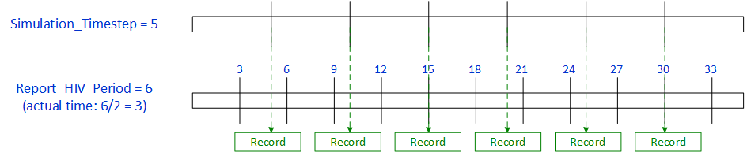
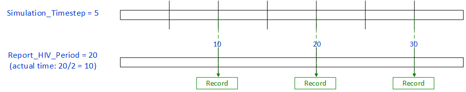

# Output settings

The following parameters configure whether or not output reports are created for the simulation,
such as reports detailing spatial or demographic data at each time step. By default, the
[InsetChart](software-report-inset-chart.md) is always created.

The following figures are examples for the parameter **Report_HIV_Period**.

When **Report_HIV_Period** is set to a value that is less than the **Simulation_Timestep**, a record
will be written during the next time step after the reported period. More than  one period may occur
before the next time step.

When **Report_HIV_Period** is greater than **Simulation_Timestep**, a record will be written during
the next time step after the period occurs. This means that a record may not be written at all time
steps.

!!! note
    Parameters are case-sensitive. For Boolean parameters, set to 1 for true or 0 for false.
    Minimum, maximum, or default values of "NA" indicate that those values are not applicable for
    that parameter.

    EMOD does not use true defaults; that is, if the dependency relationships indicate that a parameter is required, you must supply a value for it. However, many of the tools used to work with EMOD will use the default values provided below.

    JSON format does not permit comments, but you can add "dummy" parameters to add contextual
    information to your files. Any keys that are not EMOD parameter names will be ignored by the
    model.

{{ read_csv('../csv/config-output-configfile-hiv.csv', keep_default_na=False) }}
