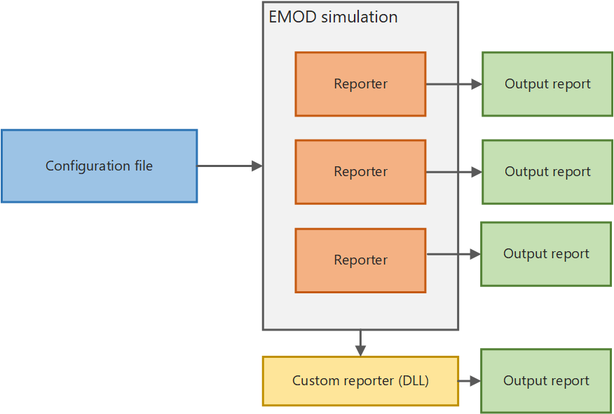

# Output reports

After running a simulation, the simulation data is extracted, aggregated, and saved as an
*output report* to the output directory in the working directory. Depending on your
configuration, one or more output reports will be created, each of which summarize different data
from the simulation. Output reports can be in JSON, CSV, or binary file formats. EMOD also
creates logging or error output files.

EMOD provides several built-in reporters for outputting data from simulations. By default, EMOD will
always generate the report InsetChart.json, which contains the simulation-wide average disease
prevalence by *time step*. If none of the provided reports generates the output report that
you require, you can create a custom reporter. For more information, see the [Advancing EMOD documentation](https://emod.idmod.org/EMOD/).



If you want to visualize the data output from an EMOD simulation, you must use graphing
software to plot the output reports. In addition to output reports, EMOD will generate error
and logging files to help troubleshoot any issues you may encounter.

## Using output reports

InsetChart.json, for example, contains per-time step values accumulated over the simulation
in a variety of reporting channels, such as new infections, prevalence, and recovered. EMOD provides
several other built-in reports that you can enable in the *configuration file* using the
[Output configuration](parameter-configuration-output.md) parameters.
Reports are generally in JSON or CSV format.

In order to interpret the output of EMOD simulations, you will find it useful to parse the output
reports into an analyzable structure. For example, you can use a Python or R script to create graphs
and charts for analysis.

For a full reference of available reports, see [Reports reference](parameter-reports-overview.md).

### Use Python to plot data

The example below uses the Python package `json` to parse the file and the Python package
[matplotlib.pyplot](https://matplotlib.org/stable/api/pyplot_api.html) to plot the output. This is a very simple example and not likely the most robust
or elegant. Be sure to set the actual path to your working directory.

```python
import os
import json
import matplotlib.pyplot as plt

# open and parse InsetChart.json
ic_json = json.loads( open( os.path.join( WorkingDirectoryLocation, "output", "InsetChart.json" ) ).read() )
ic_json_allchannels = ic_json["Channels"]
ic_json_birthdata = ic_json["Channels"]["Births"]

# plot "Births" channel by time step
plt.plot( ic_json_birthdata[  "Data"  ], 'b-' )
plt.title( "Births" )
plt.show()
```
