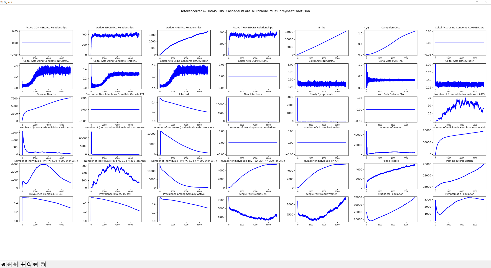

==========
InsetChart
==========

The inset chart (InsetChart.json) is an output report that is automatically generated with every simulation.
It contains simulation-wide averages, one per time step, for a wide number of data :term:`channel`\ s.
The channels are fully specified by the simulation type and cannot be altered without making changes
to the |EMOD_s| source code. Python or other tools can be used to create charts out of the information
contained in the file (see the example charts provided at the end of this page.)

Configuration
=============

To generate the report, the following parameters must be configured in the config.json file:

.. csv-table::
   :header: Parameter, Data type, Min, Max, Default, Description
   :widths: 8, 5, 5, 5, 5, 20

   Enable_Default_Reporting, boolean, NA, NA, 1, "Set this to 1 (default value) to generate the report."
   Report_HIV_Event_Channels_List, array of strings, NA, NA, [], "The list of events to be included in the report. For each event specified with this parameter, one channel will be added to the report. See :doc:`parameter-campaign-event-list` for possible values. If no events are listed, a 'Number of Events' channel will be included on the report and display the total number of all events that occurred during the simulation."
   Inset_Chart_Include_Coital_Acts, boolean, NA, NA, 0, "When set to 1, the report will include channels about the number of coital acts per relationship type per day—in total, and those using condoms (eight channels added)."
   Inset_Chart_Has_Interventions, array of strings, NA, NA, [], "A list of interventions to be included in the report. For each intervention listed, one channel is added to the report showing the fraction of the population that has that intervention at that time step. Note: the  values specified here must match the **Intervention_Name** parameters listed in the campaign.json file. See :doc:`parameter-campaign-individual-interventions` for information on configuring these parameters."
   Inset_Chart_Has_IP, array of strings, NA, NA, [], "A list of individual property (IP) keys to be included in the report. For each value of each IP key provided, one channel is added to the report showing the fraction of the population with that Key:Value pair, at that time step (for example, the fractions in Risk:LOW, Risk:MEDIUM, and Risk:HIGH). See :doc:`model-properties` for additional information on configuring IPs."
   Inset_Chart_Include_Pregnancies, boolean, NA, NA, 0, "If set to 1, three channels are included in the report showing counts of new pregnancies, current pregnancies, and possible mothers at each time step."

.. code-block:: json

    {
        "Enable_Default_Reporting": 1,
        "Report_HIV_Event_Channels_List": ["NewInfectionEvent", "HIVNeedsHIVTest", "HIVPositiveHIVTest"],
        "Inset_Chart_Coital_Acts": 1,
        "Inset_Chart_Has_Interventions": ["PrEP"],
        "Inset_Chart_Has_IP": ["InterventionStatus"],
        "Inset_Chart_Include_Pregnancies": 1
    }

Output file data
================

Headers
-------

When running HIV simulations, the header section will contain the following parameters.

.. csv-table::
   :header: Parameter, Data type, Description
   :widths: 8, 5, 10

   DateTime, string, The time stamp indicating when the report was generated.
   DTK_Version, string, The version of |EMOD_s| used.
   Report_Type, string, The type of output report.
   Report_Version, string, The format version of the report.
   Start_Time, integer, The time in days when the simulation begins.
   Simulation_Timestep, integer, The number of days in each time step.
   Timesteps, integer, The number of time steps in the simulation.
   Channels, integer, The number of channels in the simulation.
   Base_Year, float, "The absolute time in years when the simulation begins. Determined by the **Base_Year** parameter in the config.json file."

Channels
--------

When running HIV simulations, the following channels are included in the InsetChart.json file.
For channels related to the HIV stage (latent, acute, AIDS), these definitions are described in more
detail in :doc:`hiv-model-intrahost`.

.. csv-table::
  :header: Channel, Description
  :widths: 5, 8

  Active COMMERCIAL Relationships, The current number of commercial relationships.
  Active INFORMAL Relationships, The current number of informal relationships.
  Active MARITAL Relationships, The current number of marital relationships.
  Active TRANSITORY Relationships, The current number of transitory relationships.
  Births, The live births cumulative up to that day.
  Campaign Cost, The cost of campaigns cumulative up to that day (set by the **Cost_To_Consumer** parameter).
  Coital Acts Using Condoms-COMMERCIAL, "Average number of coital acts using condoms per commercial relationship per time step. Channel appears when the parameter **Inset_Chart_Include_Coital_Acts** is set to 1."
  Coital Acts Using Condoms-INFORMAL, "Average number of coital acts using condoms per informal relationship per time step. Channel appears when the parameter **Inset_Chart_Include_Coital_Acts** is set to 1."
  Coital Acts Using Condoms-MARITAL, "Average number of coital acts using condoms per marital relationship per time step. Channel appears when the parameter **Inset_Chart_Include_Coital_Acts** is set to 1."
  Coital Acts Using Condoms-TRANSITORY, "Average number of coital acts using condoms per transitory relationship per time step. Channel appears when the parameter **Inset_Chart_Include_Coital_Acts** is set to 1."
  Coital Acts-COMMERCIAL, "Average number of coital acts per commercial relationship per time step. Channel appears when the parameter **Inset_Chart_Include_Coital_Acts** is set to 1."
  Coital Acts-INFORMAL, "Average number of coital acts per informal relationship per time step. Channel appears when the parameter **Inset_Chart_Include_Coital_Acts** is set to 1."
  Coital Acts-MARITAL, "Average number of coital acts per marital relationship per time step. Channel appears when the parameter **Inset_Chart_Include_Coital_Acts** is set to 1."
  Coital Acts-TRANSITORY, "Average number of coital acts per transitory relationship per time step. Channel appears when the parameter **Inset_Chart_Include_Coital_Acts** is set to 1."
  Disease Deaths, "The number of individuals whose death is attributed to HIV/AIDS, cumulative up to that day."
  Fraction of New Infections From Rels Outside PFA, "The fraction of the total new infections that occurred in relationships created via the **StartNewRelationship** intervention, rather than the Pair Forming Algorithm (PFA)."
  Infected, "The fraction of the population currently infected."
  New Infections, The number of individuals that got infected on that day.
  Newly Symptomatic, The number individuals that became symptomatic on that day.
  Num Rels Outside PFA, "The count of relationships that were created via the **StartNewRelationship** intervention, rather than the Pair Forming Algorithm (PFA)."
  Number of (treated) Individuals with AIDS, "The number of people who have AIDS but are on ART."
  Number of (untreated) Individuals with AIDS, The number of individuals not on ART with AIDS.
  Number of (untreated) Individuals with Acute HIV, The number of individuals not on ART with acute HIV.
  Number of (untreated) Individuals with Latent HIV, The number of individuals not on ART with latent HIV.
  Number of ART dropouts (cumulative), "The number of individuals who started and dropped ART, cumulative up to that day."
  Number of Circumcised Males, The number of male individuals that are circumcised via the :doc:`parameter-campaign-individual-malecircumcision` intervention.
  Number of Events, "The total number of events (births, new infections, etc.) cumulative up to that day."
  Number of Individuals Ever in a Relationship, The number of individuals who have ever been in a relationship cumulative up to that day.
  Number of Individuals HIV+ w/ CD4 < 200 (non-ART), The number of individuals who are HIV+ with CD4 count less than 200 and NOT on ART on that day.
  Number of Individuals HIV+ w/ CD4 < 200 (on-ART), The number of individuals who are HIV+ with CD4 count less than 200 and ON ART on that day.
  Number of Individuals HIV+ w/ CD4 >= 200 (non-ART), The number of individuals who are HIV+ with CD4 count greater than 200 and NOT on ART on that day.
  Number of Individuals HIV+ w/ CD4 >= 200 (on-ART), The number of individuals who are HIV+ with CD4 count greater than 200 and ON ART on that day.
  Number of Individuals on ART, The total number of individuals on ART on that day.
  Paired People, The number of individuals currently in any type of relationship.
  Post-Debut Population, The number of individuals that are sexually active.
  "Prevalence (Females, 15-49)", The fraction of infected individuals in the population of females 15-49.
  "Prevalence (Males, 15-49)", The fraction of infected individuals in the population of males 15-49.
  Prevalence among Sexually Active, The fraction of infected individuals in the post-debut adult population.
  Single Post-Debut Men, The number of sexually active males who are currently not in a relationship.
  Single Post-Debut Women, The number of sexually active females who are currently not in a relationship.
  Statistical Population, The total number of individuals in the simulation on that day.
  Symptomatic Population, The total number of symptomatic HIV+ individuals.
  Number of Events, "If no events are listed in the **Report_HIV_Event_Channels_List** parameter, this channel will appear in the report, showing the total count of all events that occurred at each time step."
  <Event Name>, "For each even name listed in the **Report_HIV_Event_Channels_List** parameter, there will be a corresponding <Event Name> channel in the report, showing the count of those events at each time step. The **Number of Events** channel will no longer be included in the report."
  Has\ _<Intervention Name>, "For each intervention name listed in the **Inset_Chart_Has_Interventions** parameter, there will be a corresponding Has\ _<Intervention Name> channel in the report, showing counts of people that have at least one of the named interventions. Note: the intervention names in the list are not checked for accuracy; errors will result in all zeros being returned for that channel. Verify that each intervention name listed in this parameter is defined in the campaign file via the **Intervention_Name** parameter."
  HasIP\ _<Key:Value>, "For each IP key listed in the **Inset_Chart_Has_IP** parameter, corresponding HasIP\ _<Key:Value> channels will be added to the report, showing the fraction of people with that IP Key:Value pair, at that time step (one channel for each value of each IP Key). For a given IP, the fractions in each of its value channels should add up to one (1) at each time step."
  Possible Mothers, "Total number of women that could possibly be mothers (age is between 14 and 45) at each time step. Channel appears when the parameter **Inset_Chart_Include_Pregnancies** is set to 1."
  New Pregnancies, "Total number of women that became pregnant at each time step. Channel appears when the parameter **Inset_Chart_Include_Pregnancies** is set to 1."
  Currently Pregnant, "Total number of women that are currently pregnant at each time step. Channel appears when the parameter **Inset_Chart_Include_Pregnancies** is set to 1."

Example
=======

The following is an example of an HIV-specific InsetChart.json.

.. literalinclude:: ../json/report-HIV-inset-chart.json
   :language: json

   Example of plots created from HIV-specific InsetChart data
