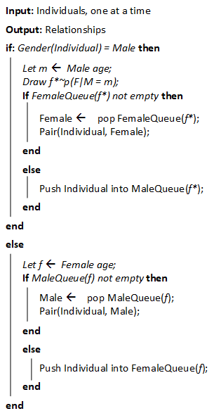
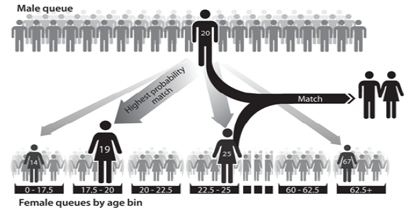
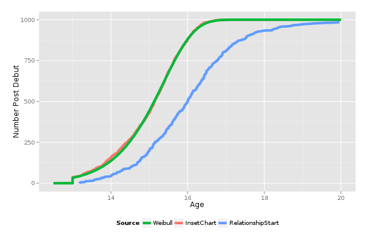
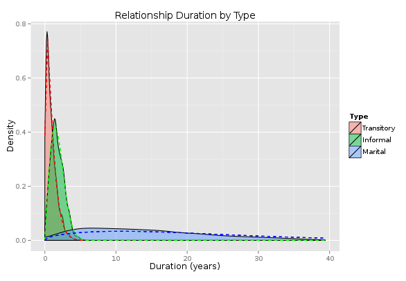
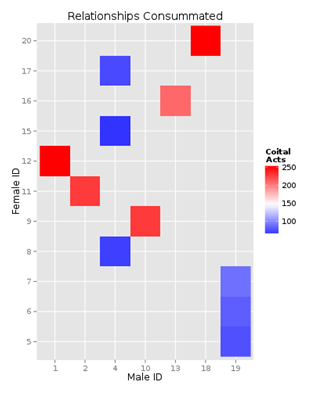
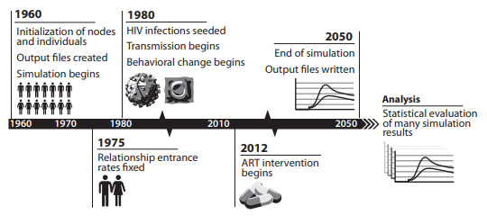

==================================
Relationships and contact networks
==================================

Human relationships are at the center of the |EMOD_s| STI model. Who individuals form sexual
relationships with, and how those partnerships are formed, are the basis for STI transmission. The
|EMOD_s| STI model contains detailed information for configuring the relationships and tracking
partnerships over time. There is a pair formation algorithm (PFA) that balances the "supply and
demand" for partners (see :ref:`PFA` for more information), and numerous parameters that configure
the type and duration of relationships, as well as the ages and behavior of the participants. These
relationship settings are configured in the demographics file; for a complete list of the parameters
see :doc:`parameter-demographics`; the majority of the relationship parameters will be located in the
**Society** section.

.. TODO will need to add a lot of pictures/figures!!
.. link to specific sections of the param guide for each section?

Relationship formation
======================

The following section will describe how |EMOD_s| determines eligibility for relationship status, and
how relationships then form and proceed among eligible individuals. As a stochastic, agent-based
model, |EMOD_s| can track individuals and create dynamic relationship networks. The
STI model has included an algorithm to form sexual relationships with a specific joint age-mixing
distribution, and enables control over the rates at which individuals seek new relationships.

For more information on relationship formation, including the math for the pair formation algorithm,
see `Klein 2012 <http://ieeexplore.ieee.org/stamp/stamp.jsp?tp=&arnumber=6426573&tag=1>`__ and
`Bershteyn et al 2013 <http://rsif.royalsocietypublishing.org/content/royinterface/10/88/20130613.full.pdf>`__.

.. _PFA:

Pair formation algorithm (PFA)
------------------------------

Individuals seeking to enter a relationship are  managed by a feed-forward pair formation algorithm
(PFA). This algorithm has been described by `Bershteyn et al 2012 <https://arxiv.org/abs/1206.3720>`__.
The PFA dynamically adjusts the rates of relationship formation as the population structure
changes; feed-forward can be disabled during the simulation to allow future patterns of relationship
formation to change in  response to demographic shifts in the population. The algorithms used for
each type of relationship (see :ref:`relationships` for more information) are identical, but utilize
different input data about the age distribution and age gaps within partnerships. Entrance into the
PFA is governed by the relationship flow (see :ref:`flow` for more information).

Internally, the algorithm maintains a series of queues that are arranged by age and gender. Discrete
age bins, N in total, are generated in a manner that is consistent with the discretization of the
input mixing matrix. The input matrix is set up such that the entry at position (i, j) is the
probability of a male of age bin i pairing with a female of age bin j. When a male of age m enters
into the algorithm, a desired female age f* is sampled from the conditional probability,

    f* ~ p(F|M = m)

.. fix equation! Fix all f*'s too

    The pair formation algorithm used to form relationships between individuals who seek them.

.. FIX the Algorithm from the 2012 paper. (and cite)

Individuals entering the PFA are immediately placed into a gender-specific queue, with males
entering into queues seeking females of a desired age and females are placed in separate queues for
specific age bins.  If a female happens to be waiting in the corresponding age bin within the
algorithm, a relationship is formed and the two individuals leave the algorithm. Otherwise, the male
will continue to wait in the queue. When a female enters into the algorithm, she proceeds directly
to the (female) age bin corresponding to her age. If a male is already waiting for a female of her
age bin, a pair is formed; otherwise she will continue to wait in the queue.

    Illustration of males and females forming queues.

The queues fill over a period of time corresponding to the relationship type. After the filling
period (the length of which is dependent on the relationship type), a processing step forms
relationships by working linearly through the male queue. A female partner is selected for the male
at the head of the queue based on age and availability. Note that for relationships with a low
probability of formation, the algorithm may have difficulty finding suitable partners, as
availability may be low. For example, the input data may be configured such that there is a 1%
chance that a 20 year old male will have a relationship with a 60 year old female.  If the 20 year
old male only has 60 year olds to choose from (because younger women are not looking for new
relationships), then there will be a skew from the desired rates due to this lack of supply.  The
parameter **PFA_Cum_Prob_Selection_Threshold**  can be used to reduce this issue.

Specifically, a male of age m samples a partner age, f, from

    p(F = f) proportional to

    p(F = f|M = m) if Nf > 0
    0 otherwise.

.. fix equation!
.. FIX MATH! AND f* 's

Here, Nf is the number of females queued in age bin f and p(F = f|M = m) is the conditional
distribution derived from the input matrix. If p(F = f) is identically zero, the male remains in the queue
for the next processing round. Otherwise, the female of the sampled age bin who has been waiting the
longest is selected as the partner. The paired individuals are removed from their respective queues,
and the process is repeated. Note that this algorithm is symmetric: in principle, either males or
females could choose based on their respective marginal distributions.

Note that age bins and other PFA parameters are configured in the demographics file; see the
**Pair_Formation_Parameters** in :doc:`parameter-demographics`.

.. _debut:

Age of sexual debut
-------------------

Individuals are eligible to enter relationships only after reaching the age of sexual debut. The age
of sexual debut is randomly drawn for each individual from a :term:`Weibull distribution`. Weibull
distributions are used often in |EMOD_s| and require two parameters: a shape parameter and a scale
parameter.

The shape parameter governs the shape of the density function. When the shape parameter is equal to
1, it is an exponential distribution. For shape parameters above 1, it forms a unimodal (hump-
shaped) density function. As the shape parameter becomes large, the function forms a sharp peak. The
inverse of the shape parameter is sometimes referred to here as the “heterogeneity” of the
distribution (heterogeneity = 1/shape), because it can be helpful to think about the degree of
heterogeneity of draws from the distribution, especially for hump-shaped functions with
heterogeneity values between 0 and 1 (i.e., shape parameters greater than 1).

The scale parameter shifts the distribution from left to right. When heterogeneity is small (i.e.,
the shape parameter is large), the scale parameter sets the location of the sharp peak. The scale
parameter is related to the median of the distribution by the equation:

    Median = Scale × (ln(2))1/Shape = Scale × (ln(2))^Heterogeneity

.. fix the equation

so that when heterogeneity is close to zero, the median is close to the scale parameter.

To define the distribution of age of sexual debut, three parameters are specified: the Weibull
heterogeneity parameter, the Weibull scale parameter, and the minimum possible age of sexual debut.
The first two parameters can be set to different values for males and females. The third
parameter prevents debut ages lower than a specific value, even if the Weibull distribution has some
mass below that value. These parameters are located in the config.json input file; for more
information on Weibull parameters, see :doc:`parameter-configuration-weibull`.

There is typically a lag between eligibility and the first relationship, and that can be due to how
partner choice is made. The input matrix enables individuals to preferentially select partner age,
and can be configured for each relationship type. To configure age preferences, the matrix will be
created in the **Pair_Formation_Parameters** in :doc:`parameter-demographics` using the
**Joint_Probabilities** parameter.

    The lag between age of eligibility for relationship formation and age at actual relationship
    formation. The green line shows the expected distribution of individuals at sexual debut, the
    red line shows the number of individuals that have reached sexual debut, and the blue line shows
    the actual age at relationship formation.

.. _flow:

Relationship flow
-----------------

For all individuals in the model, he or she may participate in multiple relationships, some of which
may occur concurrently. However, the "relationship flow" specifically refers to the processes of
breaking apart existing relationships and driving the formation of new relationships. In other
words, the processes that move individuals through the PFA.

In order for the PFA to produce relationships according to the input matrix, equal numbers of males and
females must enter the algorithm and their age distributions must match the respective marginals of
the input matrix. To ensure that this occurs, a feed-forward control is used in which the rates at which
individuals in each age bin and gender enter for each relationship type are adjusted daily. The
input matrix dictates only the relative number of relationships formed between pairs of different ages, but
not the absolute number of relationships formed by the PFA. This total throughput of relationships
formed is set such that the expected number of individuals seeking a relationship of a particular
type, after rate adjustment to meet the input matrix, matches the number of males and females that would
have sought that relationship had the rates not been adjusted for the input matrix. Thus, the rate
adjustment changes the age distributions of the individuals seeking relationships, but not the total
number of each type of relationship formed.

This adaptive daily rate control allows the model to automatically discover the rates of
relationship entry that are consistent with the input matrix. It is conceivable, however, that events
causing large demographic shifts might change the input matrix. For example, when comparing simulations
with universal HIV treatment versus no treatment, it is conceivable that demographic influence of
the disparate AIDS death tolls should cause the input matrices to diverge. Therefore, adaptive rate control
may be disabled after an initial burn-in period, after which the entrance rates will remain fixed
at their final controlled values and the input matrix is permitted to change as the simulation progresses.

.. _relationships:

Relationship types and durations
================================

Partnerships form after individuals have reached the age of sexual debut, and partners are chosen
from a pool of available individuals within the desired age group (see :ref:`PFA` for more
information). However, partnerships are also categorized by type, which will impact a variety of
factors governing relationship duration and the behavior of the participants.

Currently, |EMOD_s| supports four different types of heterosexual relationships: transitory,
informal, marital, and commercial. Each type can have independently configured mixing patterns,
rates of formation, and average durations. In addition, each type of relationship can configure
specific condom usage probabilities, rates of coital acts, and migration actions. Individuals can be
involved in multiple relationships of different types (see :ref:`concurrency` for more information
about multiple partnerships).

While relationship types are fully configurable, it is useful to use guidelines when doing so.
Transitory relationships are typically short and involve younger participants; informal
relationships tend to describe longer, non-marital relationships with participants of intermediate
age; marital relationships are long term with older participants; and commercial relationships are
those involving transactional relationships with commercial sex workers. Each relationship duration
is governed by a :term:`Weibull distribution`, which determines the duration that is assigned to a
relationship upon formation. The duration time is then used to calculate the scheduled end time of
the relationship. In some cases, relationships will dissolve prior to the scheduled end time, such
as when a participant dies. Start times, scheduled end times, and actual end times for each
relationship are recorded in output files (see :doc:`software-outputs` for more information on
output).

    An example of potential relationship durations by type (here, transitory, informal, and marital).

Coital frequency and coital dilution
------------------------------------

For sexually transmitted infections, each coital act represents a potential transmission event.
Because of this, it is possible to configure the frequency of coital acts independently for each
relationship type. Individual coital acts are simulated for disease-discordant relationships only. When
an individual becomes infected, the discordancy states of all relationships involving the individual
are updated. The timing of coital acts is random, such that the time until the next coital act is
exponentially distributed with the configured rate. When multiple coital acts occur in the same
timestep, as determined by a draw from a Poisson distribution, they are accounted for using
Bernoulli statistics with the associated transmission probability for each of the individual coital
acts.

When an individual participates in multiple partnerships simultaneously, the model can incorporate
:term:`coital dilution`, i.e., a change in the frequency of coital acts as a result of having multiple
partnerships. The reduction in coital dilution is independently configurable for individuals with
two, three, or more than three partners. When the two participants in a relationship have different
numbers of partners, then the reduction factor from the person with more partners is applied.

    The number of relationships consummated between different partners. Relationships in which both
    participants have one partner (red) have more coital acts than those in which one or both
    participants have multiple relationships (blue).

Condom usage
------------

Each relationship type has numerous relationship-specific properties, as discussed above. Condom
usage probabilities can be configured for each type; while the rate is set at the start of the
relationship, the probability of usage over time follows a sigmoidal curve which accounts for lower
usage rates in longer-term relationships. The condom usage probability, P(t) depends on the
simulation time t as follows:

P(t) = h / [1 + e ^(-R(t-t0))] +l

Where l, h, t0, and r are configurable for the parameter **Condom_Usage_Probability** (they
correspond to min, max, mid, and rate, respectively. See :doc:`parameter-demographics` for more
information).

.. fix math!!

.. _concurrency:

Concurrent partnerships
-----------------------

|EMOD_s| can be configured to allow for individuals to participate in multiple relationships
simultaneously. Concurrency is controlled by "flags" that determine if an
individual is eligible to seek additional relationships when already participating in a
relationship of that type. Flags are configured using both **Concurrency_Parameters** and
**Concurrency_Configuration** parameters in the demographics file. For each relationship type, it is
possible to configure the probability of extra relationships and the maximum number of extra
relationships for both males and females.

Enabling concurrency increases the average number of simultaneous partners, and over the course of
the simulation, also increases the average number of lifetime partners. However, despite the
increase in concurrency and number of lifetime partners, the overall size of the connected component
of the network may remain similar. Numerous factors influence network connectivity, including
population size, population structure, and the configured formation rates, durations, and mixing
patterns for each relationship type. This mix of factors determines the extent to which “serial
monogamy” is sufficient to connect the network.

Although the configuration parameters allow high levels of concurrency, the actual levels of
concurrency at any given time are likely going to be considerably lower. That is because the extra-
relational flags only create the potential for individuals to add relationships, but depending on
the formation rate and mixing pattern, actual formation may not occur. This is similar to the way
that sexual debut occurs earlier than actual formation of the first relationship. However, it is
possible to control the proportion of "potential concurrency" that is realized by modifying the rate
ratios of concurrent relationship formation for those with the appropriate flag. It should be noted
as well that the formation of a marital partnership, which has the lowest probability of permitting
concurrency and the longest duration, frequently prevents individuals from taking on additional
partnerships. Combined with the increased rates of entry into shorter transitory and informal
partnerships, this leads to increased concurrency earlier in life and declining concurrency later in
life, although there is no explicit age-dependence of concurrency in the model.

Concurrency may be configured independently across each relationship type, or may be correlated.
When concurrency is distributed independently by relationship type, few individuals will reach high
levels of concurrency; however, it is possible to concentrate risk in a subset of the population by
using correlated concurrency. These settings can be found in the **Concurrency_Configuration**
section of the :doc:`parameter-demographics`.

Time-course
-----------

The time-course of a simulation run is depicted graphically below. In general, simulations begin
prior to the start of infection, (in the example, the year 1960) to allow ample time for
relationships to “burn-in.” During this burn-in time, individuals with demographic properties dictated
in the demographics file begin forming relationships; relationship formation rates for each gender
and relationship type are updated daily using the relationship flow algorithm (see
:ref:`flow` for more information). Adjustment of pair formation entry rates is
terminated at a specific timepoint (in the example, at 1975) and the rates are fixed at that value
for the remainder of the simulation.

Next, a timepoint is selected to see infections (1980 in the example). The seeding process infects a
configured percentage of the population, as determined by data and configured in a campaign file (see
:doc:`parameter-campaign-node-outbreak` for more information).

The last portion to configure is the introduction of treatment. Here, the ART intervention is enabled
in the year 2012. Eligible individuals enroll in ART as determined in the campaign file. ART
distribution continues for the duration specified, which here is the remainder of the simulation
which runs until 2050.

    An example time-course of an EMOD simulation, originally published in
    `Bershteyn et al. 2012, arXiv <https://arxiv.org/pdf/1206.3720.pdf>`__.

